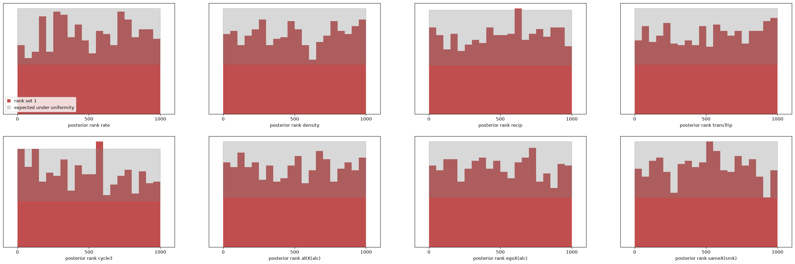

# M1 result: amortized posterior for s501 → s502

First trained estimator (GETTING_STARTED §7 items 5–6; paper plan M1).
Run 2026-09-11 on the DGX Spark. Artefacts in `data/` (not in git; regenerable):
`npe_s50.pt`, `npe_s50_posterior.npz`, `npe_s50_sbc.{npz,png}`,
`npe_s50_training.npz`, `npe_s50_report.txt`. Scripts: `benchmarks/generate_s50.py`,
`benchmarks/npe_s50.py`, `benchmarks/rsiena_estimate.R`.

## Set-up

| | |
|---|---|
| data | s501 → s502 (n = 50), covariates alc (centred), smk |
| model | rate + density, recip, transTrip, cycle3, altX(alc), egoX(alc), sameX(smk) — the set validated against RSiena 1.6.6 |
| prior | box in `docs/PRIORS.md`; fixed empirical start X0 = s501 |
| training set | 10⁶ panels, seed 1, torch CUDA float32, 150 s (6,684 panels/s) |
| summaries | 13: MoM targets (changes + 7 statistics) + outdeg_sd, indeg_sd, isolates, mutual_dyads, tie_fraction; log1p on counts, asinh on signed sums |
| estimator | `sbi` 0.27 NPE, neural spline flow, 6 transforms × 100 hidden, batch 1024, lr 5e-4, early stopping (patience 20) |
| training | 999,000 draws, 158 epochs, 74.9 min; validation loss 1.494 → −1.316 (best, epoch 138) |
| held out | 1,000 draws for SBC |

## Posterior for the observed data, vs RSiena and Robbins–Monro

RSiena: `siena07`, unconditional (`cond = FALSE`), converged in one run
(max convergence ratio 0.096), 11 s. RM: `saomsim.estimate_rm`, conditional on
the observed distance (so no rate), 102 s. NPE: 20,000 posterior samples in
0.06 s.

| parameter | RSiena est ± se | RM est ± se | NPE mean ± sd | NPE 90% | (RS − NPE)/sd | sd/se |
|---|---|---|---|---|---|---|
| rate | 6.07 ± 1.03 | — | 5.88 ± 0.93 | [4.52, 7.52] | 0.20 | 0.90 |
| density | −2.66 ± 0.22 | −2.67 ± 0.22 | −2.78 ± 0.23 | [−3.18, −2.41] | 0.48 | 1.06 |
| recip | 2.11 ± 0.28 | 2.13 ± 0.27 | 2.06 ± 0.30 | [1.58, 2.57] | 0.17 | 1.08 |
| transTrip | 0.56 ± 0.19 | 0.56 ± 0.14 | 0.64 ± 0.15 | [0.41, 0.90] | −0.56 | 0.79 |
| cycle3 | 0.05 ± 0.35 | 0.05 ± 0.31 | 0.07 ± 0.26 | [−0.39, 0.46] | −0.11 | 0.75 |
| altX(alc) | −0.07 ± 0.09 | −0.07 ± 0.10 | −0.07 ± 0.09 | [−0.23, 0.08] | −0.02 | 1.03 |
| egoX(alc) | 0.03 ± 0.10 | 0.03 ± 0.10 | 0.07 ± 0.10 | [−0.09, 0.23] | −0.40 | 1.04 |
| sameX(smk) | 0.24 ± 0.23 | 0.24 ± 0.23 | 0.28 ± 0.24 | [−0.11, 0.68] | −0.14 | 1.06 |

- Every RSiena estimate lies inside the NPE 90 % interval; the largest
  discrepancy is 0.56 posterior sd (transTrip).
- Posterior sd matches RSiena's standard error to within ~10 % for six of
  eight parameters. NPE is tighter for transTrip (0.79×) and cycle3 (0.75×);
  see the SBC note on cycle3 below before reading that as a gain.
- No 90 % interval touches the prior box.
- **This is the M1 acceptance criterion** ("agrees with RSiena on real data
  where RSiena converges") met, at a per-fit cost of 0.06 s against 11 s
  (RSiena) and 102 s (RM), after a one-off 78 min of simulation + training.

Posterior correlations worth showing (|r| > 0.3): density × sameX −0.70,
transTrip × cycle3 −0.65, density × recip −0.52, egoX × sameX +0.43,
density × transTrip −0.35, recip × cycle3 −0.32, altX × sameX +0.31.
This is the identification geometry the paper's §4.1 promises to show: the
posterior reports it directly; a point estimate with marginal s.e. hides it.
The rate is *not* strongly correlated with the objective parameters here —
one period from a fixed sparse start identifies it well enough through the
change count.

## Simulation-based calibration (1,000 held-out draws × 1,000 samples)

| parameter | KS p | C2ST(ranks) |
|---|---|---|
| rate | 0.168 | 0.589 |
| density | 0.406 | 0.594 |
| recip | 0.323 | 0.585 |
| transTrip | 0.500 | 0.559 |
| cycle3 | **0.011** | 0.582 |
| altX(alc) | 0.856 | 0.566 |
| egoX(alc) | 0.551 | 0.570 |
| sameX(smk) | 0.323 | 0.570 |

C2ST of the data-averaged posterior against the prior: 0.499 (ideal 0.5).

Reading: seven of eight parameters are consistent with uniform ranks. The
rank histograms (`npe_s50_sbc.png`) sit inside the uniformity band except
**cycle3**, which has excess mass at low ranks — the true value tends to sit
below most posterior samples, i.e. the posterior for cycle3 is slightly
biased upward and/or slightly too narrow. This is the same parameter whose
posterior sd is 0.75× RSiena's s.e., so that tightness should not be
claimed as a gain. Magnitude is modest (KS p = 0.011 with 1,000 draws; the
C2ST values are all in the 0.56–0.59 range, a mild but uniform detectable
departure). Candidate causes, in the order to try:

1. Summary information loss: cycle3's target statistic is heavy-tailed and
   strongly negatively correlated with transTrip in the posterior; the
   13 summaries may not separate them well. A learned embedding on the
   stored networks is the principled fix (and the M2 direction anyway).
2. Flow capacity / training: validation loss was still drifting at epoch
   138; a larger flow or lower learning rate is a cheap test using
   `--limit 100000` first.
3. Prior edge: cycle3's range is (−1.5, 0.5) and RSiena puts the s50 value
   near 0.05; nothing indicates edge effects for the observed data, but the
   SBC draws span the whole box.

## Coverage of central credible intervals (same held-out draws)

`python benchmarks/coverage.py data/npe_s50_sbc.npz`

| parameter | 50 % | 80 % | 90 % | 95 % |
|---|---|---|---|---|
| rate | 0.527 | 0.822 | 0.910 | 0.958 |
| density | 0.479 | 0.783 | 0.893 | 0.945 |
| recip | 0.507 | 0.797 | 0.902 | 0.955 |
| transTrip | 0.482 | 0.780 | 0.892 | 0.935 |
| cycle3 | 0.494 | 0.792 | 0.890 | 0.944 |
| altX(alc) | 0.490 | 0.791 | 0.893 | 0.940 |
| egoX(alc) | 0.523 | 0.798 | 0.899 | 0.940 |
| sameX(smk) | 0.522 | 0.826 | 0.901 | 0.951 |
| binomial s.e. | 0.016 | 0.013 | 0.009 | 0.007 |

Empirical coverage is nominal within ~2 s.e. for every parameter at every
level — including cycle3. So cycle3's SBC signal is a small *location* shift
(posterior slightly high), not intervals that are too narrow; and the
tighter-than-RSiena sd for transTrip/cycle3 is not over-confidence at the
interval level. transTrip's 95 % at 0.935 is the only value 2 s.e. low.

## Posterior predictive check on statistics outside the embedding

`python benchmarks/ppc_s50.py --B 1000`: 1,000 posterior draws, one simulated
period each from s501, compared with the observed s502 on statistics the
flow never saw.

| statistic | observed | pp mean ± sd | pp 90 % | F(obs) |
|---|---|---|---|---|
| mutual dyads | 35 | 38.8 ± 13.3 | [20, 64] | 0.43 |
| asymmetric dyads | 46 | 46.8 ± 9.7 | [33, 64] | 0.49 |
| null dyads | 1144 | 1139 ± 17 | [1109, 1165] | 0.57 |
| max out-degree | 5 | 7.3 ± 1.9 | [5, 11] | 0.09 |
| max in-degree | 6 | 7.5 ± 2.0 | [5, 11] | 0.25 |
| in-degree Gini | 0.369 | 0.420 ± 0.052 | [0.34, 0.51] | 0.17 |
| out-isolates | 3 | 6.9 ± 3.0 | [3, 12] | 0.08 |
| transitivity | 0.373 | 0.347 ± 0.113 | [0.18, 0.54] | 0.60 |
| fraction reachable | 0.360 | 0.555 ± 0.171 | [0.25, 0.81] | 0.15 |
| mean geodesic | 4.49 | 4.09 ± 0.65 | [3.17, 5.22] | 0.78 |
| degree assortativity | 0.094 | 0.184 ± 0.156 | [−0.07, 0.44] | 0.29 |

Nothing outside the central 95 %. The mild tensions all point one way —
fewer out-isolates, lower maximum out-degree, and less reachability than the
fitted model predicts: s502's *activity* is more even across actors than a
model with no out-degree activity/popularity effects can produce. That is a
model-specification finding (add `outAct`/`inPop`-type effects), not an
estimator finding, and it is exactly what RSiena's `sienaGOF` reports for
this effect set. Useful for §4: the PPC diagnoses the model independently of
how the posterior was obtained.

## Tuning sweep on 10⁵ draws (2026-09-12) — a negative result worth keeping

Four configurations trained on the first 10⁵ draws (1,000 held out), to see
whether architecture fixes cycle3 cheaply. It does not; data does.

| config | batch | flow | epochs | best val loss | KS p < 0.05 on |
|---|---|---|---|---|---|
| M1 (reference) | 1024 | NSF 6 × 100 | 158 (10⁶ rows) | **−1.316** | cycle3 (0.011) |
| A | 1024 | NSF 6 × 100 | 205 | −0.844 | density (0.003) |
| B | 4096 | NSF 8 × 100 | 222 | −0.490 | rate (0.001), density (0.019), transTrip (0.028), cycle3 (0.005) |
| C | 4096 | NSF 10 × 128, lr 3e-4 | 301 (cap) | −0.513 | density (0.004), cycle3 (0.023) |
| D | 4096 | MAF 8 × 100 | 301 (cap) | −0.153 | density (0.001), transTrip (0.005) |

- Ten times more data moved the validation loss from −0.84 to −1.32 and
  cleared every parameter but cycle3. No architecture change at 10⁵ came
  close. **Calibration here is data-limited, not capacity-limited.**
- Batch 4096 is worse than 1024 at 10⁵ rows (fewer gradient steps per
  epoch); C and D hit the 300-epoch cap still improving. MAF is clearly worse
  than NSF on these summaries.
- cycle3's rank deviation has no consistent direction across runs (M1 and B
  skew low, C skews high) and the tail masses P(r < 0.1) + P(r > 0.9) are
  0.20–0.23 against 0.20 expected; coverage is nominal. Reading: cycle3 is the
  least identified parameter (posterior sd 0.26 vs prior sd 0.58) and sits at
  the edge of what 13 summaries plus this training budget resolve. Not a
  bias. Two honest routes, both deferred to M2 where the architecture changes
  anyway: more data (10⁷ panels is ~25 min of simulation; training scales
  linearly) and a learned embedding on the stored networks.
- Do not tune on 10⁵ for calibration questions; use it only for smoke tests.

## Cost accounting

| step | wall clock |
|---|---|
| simulate 10⁶ panels (GPU) | 150 s |
| train NSF (GPU) | 75 min |
| posterior for one dataset | 0.06 s |
| SBC, 1,000 × 1,000 | 12 s |
| RSiena, one dataset | 11 s |
| RM (saomsim), one dataset | 102 s |

Break-even against RSiena is ~400 datasets; against the amortized
estimator's own SBC-checked posterior there is no classical equivalent.
The 75 min is dominated by 158 epochs over 10⁶ rows at batch 1024; the
smoke run suggests 10⁵ rows trains in a few minutes — use `--limit` to tune,
then train once at full size.

## What to do next

- ~~Tune on 10⁵~~ done: data-limited, see above.
- ~~Coverage table~~ done: nominal.
- ~~Posterior predictive check~~ done: nothing outside 95 %; mild excess
  out-degree heterogeneity in the model (specification, not estimator).
- M2: condition on X0 so one estimator covers many networks. Bring the
  learned embedding in there; re-examine cycle3 with 10⁷ panels then.
