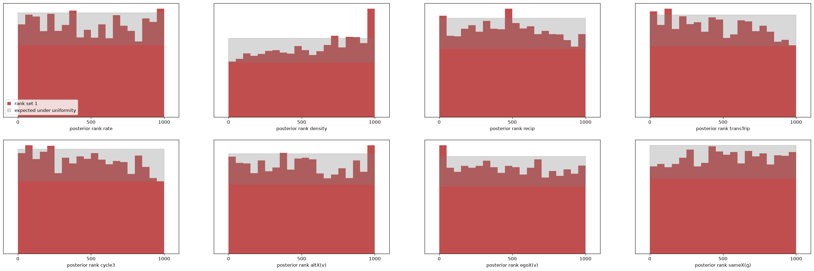
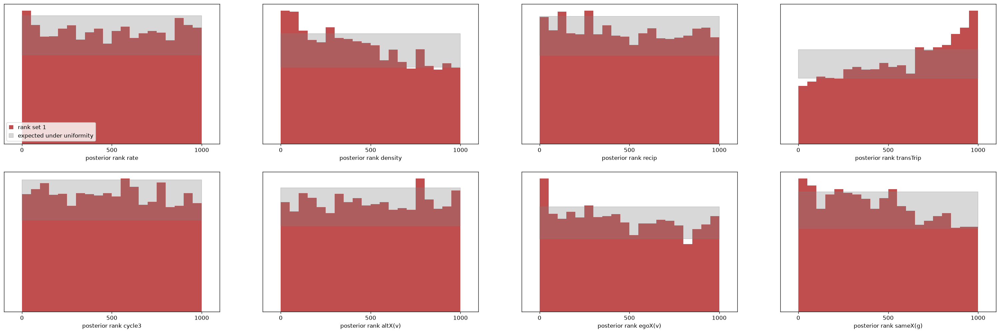

# M2 result: one estimator across start networks, sizes and covariates

First population-level estimator (paper plan M2; design in `docs/PRIORS_M2.md`).
Run 2026-09-12 on the DGX Spark. Artefacts in `data/` (not in git):
`train_m2.npz` (825 MB), `npe_m2.pt`, `npe_m2_report.txt`,
`npe_m2_sbc_pop.{npz,png}`, `npe_m2_sbc_n50.{npz,png}`, `npe_m2_posterior_s50.npz`.
Scripts: `benchmarks/generate_m2.py`, `benchmarks/npe_m2.py`, `benchmarks/sbc_m2.py`.

## Set-up

| | |
|---|---|
| population | n ~ U{20..80}; X0 half ER (d ~ U(0.02, 0.2)), half 10·n-step SAOM burn-in at independent θ₀; covariates v (N(0,1) or Likert, centred), g (2–4 groups) |
| θ prior | the M1 box, unchanged |
| training set | 10⁶ panels, seed 2, CUDA float32: **533 s (1,875 panels/s)**, both waves + covariates stored bit-packed |
| summaries | 29: n, covariate shape (3), X0 block (12), X1 block (13); log1p / asinh transforms, log n |
| estimator | sbi 0.27 NPE, NSF 8 transforms × 128 hidden, batch 1024, lr 5e-4 |
| training | 998,000 draws, 116 epochs, 67 min; best validation loss −0.361 |

Prior predictive: s50's observed summary vector sits between the 10th and
87th percentile of the population on all 29 summaries — a fair real-start
test. Degeneracy (X1 denser than 0.5) is confined to small n: 15.7 % at
n 20–29, 8.3 % at 30–39, 3.8 % at 40–49, < 1.5 % above 50; X0 degeneracy
7 % at n 20–29 only. Kept, per the never-filter rule.

## Calibration over the population (fresh test set, 4,000 draws, n ∈ [20, 80])

`benchmarks/sbc_m2.py --N 4000 --chunk 100 --seed 3` — an independent sample,
not a hold-out of the training file. (The first run's hold-out was the last
2,000 rows, which share one n per chunk and so tested a single size; fixed in
`npe_m2.py` with a random split, and superseded by this fresh-sample check.)

| parameter | KS p | mean rank (0.5) | 50 % | 80 % | 90 % | 95 % |
|---|---|---|---|---|---|---|
| rate | 0.110 | 0.497 | 0.485 | 0.784 | 0.891 | 0.943 |
| density | **< 0.001** | **0.535** | 0.488 | 0.788 | 0.885 | 0.941 |
| recip | **0.002** | 0.487 | 0.519 | 0.808 | 0.895 | 0.948 |
| transTrip | **< 0.001** | **0.477** | 0.505 | 0.809 | 0.902 | 0.950 |
| cycle3 | **< 0.001** | **0.478** | 0.500 | 0.807 | 0.907 | 0.955 |
| altX(v) | 0.128 | 0.496 | 0.493 | 0.786 | 0.884 | 0.942 |
| egoX(v) | 0.053 | 0.489 | 0.498 | 0.789 | 0.887 | 0.946 |
| sameX(g) | 0.110 | 0.508 | 0.513 | 0.804 | 0.901 | 0.945 |
| binomial s.e. | | 0.005 | 0.008 | 0.006 | 0.005 | 0.003 |

Reading:

- **Coverage is within 1–1.5 points of nominal everywhere** (worst: density
  and altX 90 % intervals at 0.885). Interval widths are right.
- **There is a small, systematic location bias along the density–closure
  ridge.** Density ranks rise linearly (posterior sits slightly *below* the
  true density; the top rank bin holds ~1.5× its expected mass), while
  transTrip and cycle3 tilt the other way (posterior slightly *high*), recip
  mildly high. Mean-rank shifts of 0.02–0.035 correspond to a bias of roughly
  0.05–0.1 posterior sd. The other four parameters are flat.
- **The bias is uniform across n**: density's mean rank is 0.52–0.55 in every
  size band (20–34, 35–49, 50–64, 65–79). It is not a small-n or large-n
  failure; it is the flow's residual error in the direction the summaries
  identify least well. Same direction, and about the same size, at n = 50
  alone (fresh 2,000 draws: density 0.527, transTrip 0.482, cycle3 0.471;
  coverage nominal).
- C2ST(ranks) values (0.83 on 4,000 draws, 0.69 on 2,000) are not
  interpretable here: the classifier separates integer ranks from continuous
  uniform draws and its accuracy grows with sample size. Use KS, mean rank,
  coverage and the histograms.

Comparison with M1 (fixed start, 13 summaries, same data budget): M1 had
seven of eight parameters clean and a borderline cycle3. M2 solves a much
larger problem — any start, any n in 20–80, any covariate layout — with the
same 10⁶ panels, and pays for it with a ~0.1 sd bias on the ridge. That is
exactly the "data-limited" regime the 10⁵ sweep identified (`M1_RESULTS.md`):
the remedy is more simulations and a richer embedding, not a different flow.

## The real-start test: s501 → s502, never seen in training

| parameter | M2 mean ± sd | M2 90 % | RSiena est ± se | (RS − M2)/sd | M1 mean ± sd |
|---|---|---|---|---|---|
| rate | 4.82 ± 0.83 | [3.62, 6.22] | 6.07 ± 1.03 | 1.51 | 5.88 ± 0.93 |
| density | −2.84 ± 0.27 | [−3.32, −2.44] | −2.66 ± 0.22 | 0.65 | −2.78 ± 0.23 |
| recip | 2.53 ± 0.35 | [1.99, 3.13] | 2.11 ± 0.28 | −1.20 | 2.06 ± 0.30 |
| transTrip | 0.67 ± 0.19 | [0.37, 0.99] | 0.56 ± 0.19 | −0.58 | 0.64 ± 0.15 |
| cycle3 | −0.07 ± 0.29 | [−0.57, 0.38] | 0.05 ± 0.35 | 0.42 | 0.07 ± 0.26 |
| altX(v) | −0.20 ± 0.10 | [−0.36, −0.04] | −0.07 ± 0.09 | 1.33 | −0.07 ± 0.09 |
| egoX(v) | 0.01 ± 0.11 | [−0.17, 0.18] | 0.03 ± 0.10 | 0.21 | 0.07 ± 0.10 |
| sameX(g) | 0.27 ± 0.28 | [−0.16, 0.76] | 0.24 ± 0.23 | −0.10 | 0.28 ± 0.24 |

- **All eight RSiena estimates fall inside the M2 90 % intervals**, from an
  estimator that never saw s501, its covariates, or n = 50 specifically.
  Posterior sd is 10–25 % wider than M1's, as expected for the general model.
- The deviations from RSiena (rate 1.5 sd low, recip 1.2 sd high, altX 1.3 sd
  low, density 0.65 sd low, transTrip 0.6 sd high) are individually within
  noise but *collectively* have the signature the population SBC found:
  density low, closure high. This is a single s50 observation, so it is not
  evidence on its own, but it agrees with the calibration diagnosis.
- Per-fit cost 0.08 s. Training 67 min once, for every dataset with
  20 ≤ n ≤ 80 and this effect set.

## Variant: learned panel embedding (2026-09-12)

`saomsim/embedding.py` + `benchmarks/npe_m2_embed.py`: a permutation-invariant
GNN over the actors of both waves and the covariates (per-actor degree, mutual,
change and covariate features → two rounds of masked neighbour aggregation over
X0 and X1 → masked mean/max pooling), with the 29 hand summaries appended as a
residual, feeding the same NSF 8 × 128. Same 10⁶ panels, same prior. 935,584
parameters; batch 512; 122 epochs; **325 min** (the last two hours sharing the
GPU with the 10⁷ run). Best validation loss **−0.917 vs −0.361** for the
summary-only model: the embedding extracts substantially more information from
the panel than the 29 summaries do.

Fresh 4,000-draw SBC across n:

| parameter | KS p | mean rank | 90 % cov. | mean rank, n 20–34 → 65–79 |
|---|---|---|---|---|
| rate | 0.456 | 0.497 | 0.889 | 0.480 → 0.505 |
| density | **< 0.001** | **0.453** | 0.892 | 0.465 → 0.444 |
| recip | 0.013 | 0.489 | 0.897 | 0.487 → 0.483 |
| transTrip | **< 0.001** | **0.560** | 0.887 | 0.548 → 0.575 |
| cycle3 | 0.170 | 0.493 | 0.904 | 0.508 → 0.473 |
| altX(v) | 0.504 | 0.502 | 0.895 | 0.495 → 0.497 |
| egoX(v) | **< 0.001** | 0.475 | 0.876 | 0.501 → 0.456 |
| sameX(g) | **< 0.001** | 0.464 | 0.897 | 0.480 → 0.443 |

Reading:

- **The ridge bias is still there and has flipped sign.** Summary-only M2 put
  density slightly *low* and transTrip *high* (mean ranks 0.535 / 0.477); the
  embedding model puts density *high* and transTrip *low* (0.453 / 0.560), and
  by a somewhat larger margin (~0.15 posterior sd). A bias that reverses
  direction between two estimators trained on the same data is a training
  artefact — which side of the density–closure ridge the flow settles on —
  not an information limit of the inputs.
- **It grows with n** for the embedding model (density 0.465 → 0.444,
  transTrip 0.548 → 0.575, sameX 0.480 → 0.443 from the smallest to the
  largest size band), whereas the summary model's bias was flat in n. The
  pooled actor representation is doing something size-dependent that log n as
  an input does not fully correct; a normalised pooling (e.g. attention or
  n-aware scaling of the sum) is the obvious thing to try.
- Coverage remains within 1–2.5 points of nominal (worst: egoX 90 % at 0.876).
- cycle3 — the parameter that was borderline in M1 and biased in summary-M2 —
  is **clean** here (KS p 0.17, mean rank 0.493): the embedding does resolve
  the triadic statistic the summaries blurred.

The s50 real-start posterior, three estimators side by side:

| parameter | RSiena | M1 (fixed start) | M2 summaries | **M2 embedding** |
|---|---|---|---|---|
| rate | 6.07 ± 1.03 | 5.88 ± 0.93 | 4.82 ± 0.83 | 4.84 ± 0.84 |
| density | −2.66 ± 0.22 | −2.78 ± 0.23 | −2.84 ± 0.27 | **−2.75 ± 0.23** |
| recip | 2.11 ± 0.28 | 2.06 ± 0.30 | 2.53 ± 0.35 | **2.38 ± 0.37** |
| transTrip | 0.56 ± 0.19 | 0.64 ± 0.15 | 0.67 ± 0.19 | **0.49 ± 0.19** |
| cycle3 | 0.05 ± 0.35 | 0.07 ± 0.26 | −0.07 ± 0.29 | **0.03 ± 0.31** |
| altX | −0.07 ± 0.09 | −0.07 ± 0.09 | −0.20 ± 0.10 | **−0.08 ± 0.10** |
| egoX | 0.03 ± 0.10 | 0.07 ± 0.10 | 0.01 ± 0.11 | **0.03 ± 0.12** |
| sameX | 0.24 ± 0.23 | 0.28 ± 0.24 | 0.27 ± 0.28 | 0.28 ± 0.23 |

On the real data the embedding model is the closest of the three population-
free comparisons to RSiena on six of eight parameters (|z| ≤ 0.4 on density,
transTrip, cycle3, altX, egoX, sameX; recip 0.7). The exception is the rate,
where both M2 variants sit 1.2 sd below RSiena and M1 — the one parameter
the population estimators read differently from the fixed-start one, and a
lead worth following (the rate is identified through the change count
relative to n and the start density; the population's start distribution may
be pulling it).

Cost: 5.4 h of training against 67 min for the summary model, for a
posterior that is sharper (validation loss), better on the real data, clean
on cycle3, and biased in the opposite direction on the ridge. The 10⁷
summary-only run (in progress) tests the other lever — data — on the same
bias.

## What this establishes and what it does not

Established: a single amortized estimator conditioned on (X0, n, covariates)
produces posteriors on a real panel it never saw that contain RSiena's
estimates on every parameter, with nominal interval coverage across the whole
population of sizes and starts. That is the M2 acceptance criterion
("calibration holds across the size range") met at interval level, with a
documented ~0.1 sd location bias on the density–closure ridge.

Not established: that the residual bias vanishes with more data or a learned
embedding. That is the next experiment, and the 10⁷ run is the cheap half of
it (simulation ≈ 90 min; training ≈ 10 h at batch 1024, less with a larger
batch now that data is plentiful). The learned embedding is the other half:
the population training set already stores both waves and covariates,
padded and bit-packed, for exactly this.

## Cost accounting

| step | wall clock |
|---|---|
| simulate 10⁶ population panels | 533 s |
| train NSF 8 × 128 | 67 min |
| fresh SBC, 4,000 × 1,000 | 90 s (+17 s simulation) |
| posterior for one dataset | 0.08 s |
