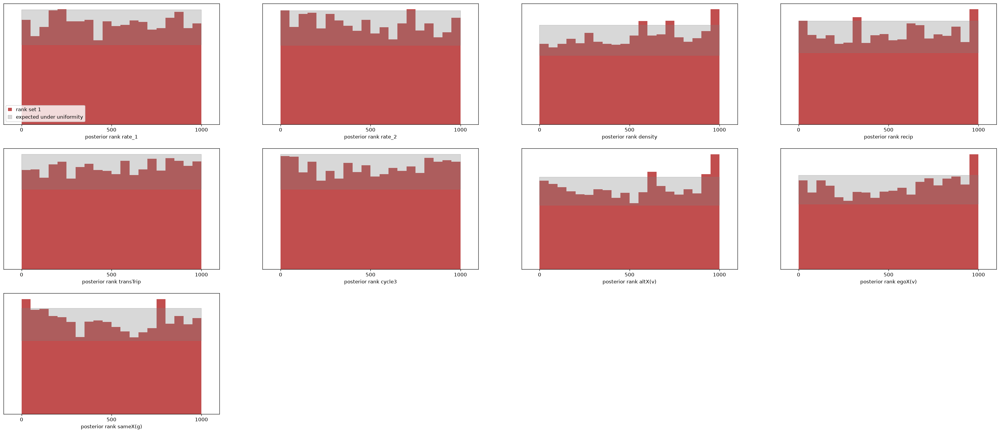
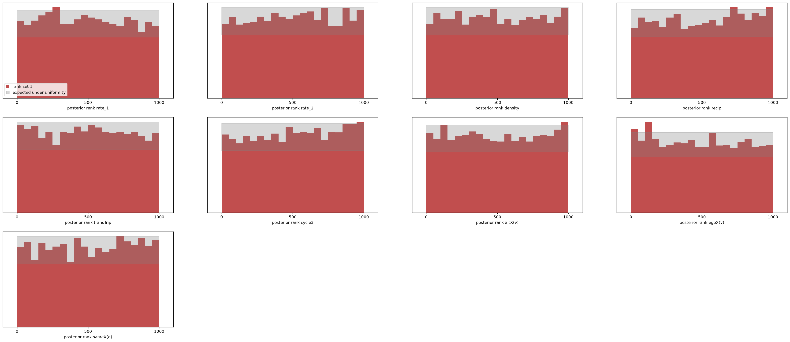
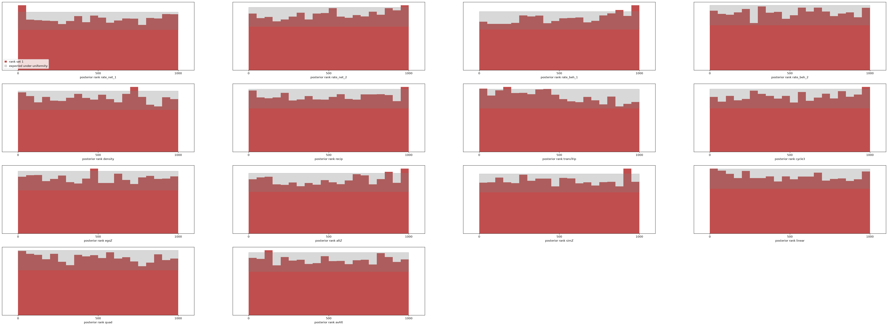
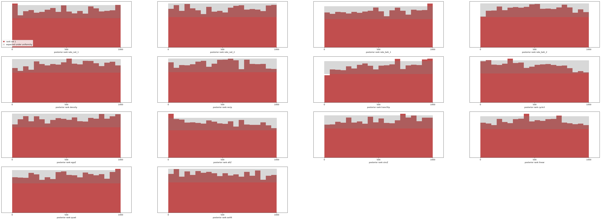
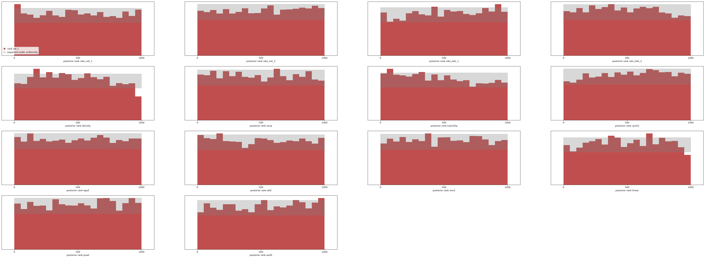
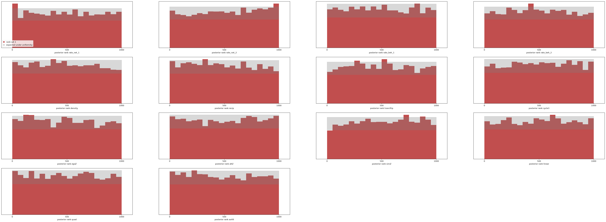

# M3a result: three waves, per-period rates, shared effects

Design: `docs/PRIORS_M3.md`. Run 2026-09-13 on the Spark. Artefacts in `data/`:
`train_m3.npz` (1.17 GB), `npe_m3.pt`, `npe_m3_sbc_pop.{npz,png}`,
`npe_m3_posterior_s50.npz`, `npe_m3_report.txt`.

## Set-up

| | |
|---|---|
| θ | rate₁, rate₂ (each U(1, 12)) + the seven M2 effects: 9 parameters |
| population | identical to M2 (n ~ U{20..80}, same starts and covariates); two periods simulated in sequence |
| training set | 10⁶ three-wave panels, seed 30, 740 s (1,352 panels/s) |
| summaries | 42: n, covariate shape, X0 block, one 13-block per period |
| estimator | NSF 8 × 128, batch 1024; 152 epochs, 77.5 min; best validation loss **−0.901** (two-wave M2 on the same budget: −0.361) |

s50's three-wave summary vector is in-distribution on all 42 summaries
(percentiles 0.10–0.87).

## Calibration across the population (fresh 4,000 draws, n ∈ [20, 80])

| parameter | KS p | mean rank | 50 % | 80 % | 90 % | 95 % |
|---|---|---|---|---|---|---|
| rate₁ | 0.530 | 0.498 | 0.492 | 0.808 | 0.899 | 0.945 |
| rate₂ | 0.029 | 0.489 | 0.498 | 0.796 | 0.891 | 0.944 |
| density | < 0.001 | 0.518 | 0.505 | 0.792 | 0.891 | 0.942 |
| recip | 0.196 | 0.505 | 0.495 | 0.787 | 0.879 | 0.937 |
| transTrip | 0.289 | 0.506 | 0.494 | 0.797 | 0.898 | 0.947 |
| cycle3 | 0.326 | 0.501 | 0.485 | 0.782 | 0.891 | 0.942 |
| altX(v) | 0.001 | 0.511 | 0.479 | 0.765 | 0.875 | 0.933 |
| egoX(v) | < 0.001 | 0.517 | 0.473 | 0.780 | 0.879 | 0.934 |
| sameX(g) | 0.001 | 0.489 | 0.463 | 0.784 | 0.887 | 0.938 |
| binomial s.e. | | 0.005 | 0.008 | 0.006 | 0.005 | 0.003 |

- Coverage within 1–3 points of nominal everywhere (worst: altX 80 % at 0.765).
- The M2-at-10⁶ ridge bias is largely absent here: transTrip, recip and cycle3
  are clean (mean ranks 0.501–0.506); density tilts mildly (0.518, i.e. the
  posterior slightly low) and the covariate effects show small tilts of
  0.01–0.02 in mean rank (≈ 0.03–0.05 sd). The third wave adds enough
  information that the same 10⁶ budget gets closer to calibration than the
  two-wave model did.
- Mild size dependence at the top of the range (n 65–80: recip 0.53–0.59,
  transTrip 0.53) — the same corner the M2 models found hardest.

## Real data: s501 → s502 → s503 vs RSiena's three-wave fit

| parameter | RSiena est ± se | M3 mean ± sd | M3 90 % | (RS − M3)/sd | M2 two-wave sd (10⁷) |
|---|---|---|---|---|---|
| rate₁ | 6.51 ± 1.07 | 5.37 ± 1.01 | [4.04, 7.17] | 1.13 | 0.97 |
| rate₂ | 5.30 ± 0.89 | 4.69 ± 0.78 | [3.55, 6.00] | 0.79 | — |
| density | −2.76 ± 0.16 | −2.69 ± 0.20 | [−3.03, −2.39] | −0.40 | 0.27 |
| recip | 2.44 ± 0.21 | 2.64 ± 0.24 | [2.28, 3.06] | −0.84 | 0.29 |
| transTrip | 0.64 ± 0.15 | 0.70 ± 0.15 | [0.46, 0.94] | −0.40 | 0.17 |
| cycle3 | −0.07 ± 0.28 | −0.09 ± 0.27 | [−0.55, 0.36] | 0.07 | 0.28 |
| altX(v) | −0.02 ± 0.07 | −0.08 ± 0.07 | [−0.19, 0.04] | 0.75 | 0.11 |
| egoX(v) | 0.06 ± 0.08 | 0.07 ± 0.07 | [−0.04, 0.18] | −0.12 | 0.10 |
| sameX(g) | 0.17 ± 0.17 | 0.03 ± 0.24 | [−0.36, 0.43] | 0.55 | 0.30 |

- **All nine RSiena estimates within 1.13 posterior sd**, and inside the M3
  90 % intervals, from an estimator that never saw s50.
- **The third wave tightens the posterior as it tightens RSiena's s.e.**:
  density sd 0.20 (two-wave M2: 0.27; RSiena 0.16 vs 0.22), recip 0.24 (0.29;
  RSiena 0.21 vs 0.28), transTrip 0.15 (0.17; RSiena 0.15 vs 0.19). The
  estimator extracts the extra information the extra wave carries.
- Both rates sit ~1 sd below RSiena (5.37 vs 6.51; 4.69 vs 5.30). The two-wave
  M2 model at 10⁶ had the same rate under-read, which vanished at 10⁷. Expect
  the same here; the 10⁷ three-wave run is the obvious next step and costs
  what the two-wave one did.
- Per-fit cost 0.07 s against RSiena's 24 s.

## What this establishes

Multi-wave estimation works in the same framework with no change to the
simulator: W − 1 sequential periods, one rate each, shared effects. The
estimator's posterior tightens with a third wave in step with RSiena's, and
matches RSiena on the canonical three-wave data set. Time-heterogeneous
effects are not modelled (nor in RSiena's default); a `sienaTimeTest`-style
check on the amortized posterior — compare per-period posteriors from the
two-wave estimator applied to each period — is a cheap diagnostic to add.

(The 10⁷ run below removed the residual rate tilt; M3b follows.)

## Ten million three-wave panels (2026-09-14)

Same architecture on ten 10⁶ shards (`data/m3_shards`, seeds 40–49; ~2.5 h of
generation while sharing the machine), batch 4096, lr 1e-3: **181 epochs,
513 min**; best validation loss **−1.555** (10⁶: −0.901).

Fresh 4,000-draw SBC across n: coverage **nominal within one point** at every
level for all nine parameters; mean ranks 0.486–0.515 (density 0.501 and
transTrip 0.494 — the ridge is clean; cycle3 0.515, recip 0.512 and egoX 0.486
carry KS p < 0.05 but no coverage deficit).

s501 → s502 → s503 vs RSiena:

| parameter | RSiena | 10⁶ M3 | **10⁷ M3** | (RS − 10⁷)/sd |
|---|---|---|---|---|
| rate₁ | 6.51 ± 1.07 | 5.37 ± 1.01 | **5.99 ± 1.07** | 0.49 |
| rate₂ | 5.30 ± 0.89 | 4.69 ± 0.78 | **5.27 ± 0.91** | 0.04 |
| density | −2.76 ± 0.16 | −2.69 ± 0.20 | **−2.73 ± 0.20** | −0.15 |
| recip | 2.44 ± 0.21 | 2.64 ± 0.24 | **2.55 ± 0.24** | −0.44 |
| transTrip | 0.64 ± 0.15 | 0.70 ± 0.15 | **0.51 ± 0.14** | 0.92 |
| cycle3 | −0.07 ± 0.28 | −0.09 ± 0.27 | **−0.01 ± 0.27** | −0.22 |
| altX | −0.02 ± 0.07 | −0.08 ± 0.07 | **−0.08 ± 0.08** | 0.69 |
| egoX | 0.06 ± 0.08 | 0.07 ± 0.07 | **0.04 ± 0.09** | 0.17 |
| sameX | 0.17 ± 0.17 | 0.03 ± 0.24 | **0.14 ± 0.22** | 0.14 |

All nine within 0.92 sd; both rates now sit on RSiena's values (z 0.49 and
0.04) where the 10⁶ model had them ~1 sd low. The same pattern as the two-wave
case: rate under-reads at 10⁶ are a data-limited training artefact, and the
posterior tightening with the third wave is preserved (density sd 0.20, recip
0.24, transTrip 0.14).

---

# M3b result: network–behaviour co-evolution (selection versus influence)

Design: `docs/PRIORS_M3b.md`. Run 2026-09-13. Artefacts: `data/train_coev3.npz`,
`data/npe_coev3.pt`, `data/npe_coev3_sbc_pop.{npz,png}`, `data/npe_coev3_posterior_s50.npz`.
Script: `benchmarks/npe_coev.py` (generate / train / sbc / s50).

## Gate (closed before any estimator)

- All 14 of RSiena's per-period target statistics for the s50 network × alcohol
  model reproduced to 4 × 10⁻¹⁴ (`benchmarks/test_rsiena_coevolution.py`). Three
  conventions had to be found empirically: behaviour centred by the grand mean over
  all waves; `simMean` averaged over *period-start* waves only; targets
  cross-lagged (behaviour statistics use end-of-period behaviour with the
  start-of-period network, selection statistics the reverse).
- The joint simulator matches RSiena's `siena07(simOnly = TRUE)` at fixed θ on all
  12 network and behaviour statistics (2,000 vs 4,000 draws: |z| ≤ 2.0, sd ratios
  0.99–1.03).

## Set-up

| | |
|---|---|
| θ | rate_net₁, rate_net₂, rate_beh₁, rate_beh₂, density, recip, transTrip, cycle3, egoZ, altZ, simZ (selection), linear, quad, avAlt (influence): **14 parameters** |
| population | M2 starts and sizes; behaviour on {1..z_max}, z_max ∈ {3,4,5}, unimodal start; centring constants from the start behaviour and passed as inputs |
| training set | 10⁶ three-wave joint panels, 66 min (252 panels/s; a joint 3-wave panel has ~3× the ministeps of a 2-wave network-only one) |
| summaries | 62: n, z_max, zbar, simMean; X0 block + selection targets + z0 descriptives; per period: network block, selection targets, behaviour change count, behaviour targets, z descriptives |
| estimator | NSF 8 × 128, batch 1024; 121 epochs, 146 min (GPU shared with the 10⁷ M3a run) |

s50's three-wave co-evolution vector sits inside the population on all 62
summaries (percentiles 0.09–0.98).

## Calibration across the population (fresh 4,000 draws, n ∈ [20, 80], z_max ∈ {3,4,5})

Coverage of central intervals is **nominal within 1.6 points for all 14
parameters** (worst: rate_net₁ 90 % at 0.884). Mean ranks 0.475–0.519. KS flags
transTrip (0.475, the closure tilt seen in every 10⁶ model), rate_beh₁ (0.519),
altZ (0.509) and rate_net₂ (0.512) at p < 0.05; the other ten are clean. The two
substantive parameters are clean: **simZ 0.499 (KS p 0.66), avAlt 0.497 (p 0.61)**.
No systematic drift with n.

## Real data: s50 network × alcohol, three waves, vs RSiena

| parameter | RSiena est ± se | M3b mean ± sd | M3b 90 % | (RS − M3b)/sd |
|---|---|---|---|---|
| rate_net₁ | 6.53 ± 1.07 | 5.26 ± 0.98 | [3.94, 7.05] | 1.29 |
| rate_net₂ | 5.15 ± 0.84 | 4.36 ± 0.68 | [3.38, 5.53] | 1.16 |
| rate_beh₁ | 1.32 ± 0.39 | 1.24 ± 0.32 | [0.80, 1.81] | 0.25 |
| rate_beh₂ | 1.78 ± 0.45 | 2.45 ± 0.89 | [1.36, 4.25] | −0.75 |
| density | −2.76 ± 0.15 | −2.97 ± 0.18 | [−3.28, −2.67] | 1.12 |
| recip | 2.39 ± 0.22 | 2.60 ± 0.27 | [2.17, 3.06] | −0.76 |
| transTrip | 0.66 ± 0.15 | 0.64 ± 0.18 | [0.36, 0.94] | 0.12 |
| cycle3 | −0.10 ± 0.30 | −0.03 ± 0.31 | [−0.58, 0.42] | −0.23 |
| egoZ | 0.05 ± 0.11 | 0.17 ± 0.16 | [−0.08, 0.44] | −0.75 |
| altZ | −0.06 ± 0.11 | −0.13 ± 0.18 | [−0.43, 0.14] | 0.40 |
| **simZ (selection)** | **1.42 ± 0.64** | **2.44 ± 0.79** | [1.10, 3.70] | −1.29 |
| linear | 0.42 ± 0.24 | 0.46 ± 0.30 | [0.02, 1.02] | −0.13 |
| quad | −0.60 ± 0.35 | −1.00 ± 0.30 | [−1.42, −0.43] | 1.30 |
| **avAlt (influence)** | **1.33 ± 0.86** | **2.70 ± 0.91** | [1.05, 3.90] | −1.50 |

- **All 14 RSiena estimates lie inside the M3b 90 % intervals**; max |z| 1.50.
- **Both mechanisms are recovered as present**: the posterior puts selection on
  similarity (simZ) and influence (avAlt) clearly above zero — the 90 % intervals
  exclude zero for both, as RSiena's ±2 s.e. roughly do. The amortized posterior
  places both somewhat higher than RSiena (by 1.3–1.5 sd); given the 10⁶ rate
  under-reads seen in every other 10⁶ model here, and their disappearance at 10⁷,
  a 10⁷ co-evolution run is the natural next check before reading anything into
  the difference.
- **Selection and influence are only weakly correlated in the posterior
  (r = −0.14).** The cross-lagged design (network changes read against start-of-
  period behaviour, behaviour changes against start-of-period network) separates
  the two mechanisms, and the amortized posterior shows that directly — the
  identification argument of Steglich, Snijders & Pearson (2010) made visible as
  posterior geometry.
- Per fit: **0.6 s** for a 14-parameter joint posterior, against RSiena's 31 s.

## What this establishes

The full co-evolution SAOM — the model class the paper plan's M3 names and the
one behind the selection-versus-influence literature — runs in the same amortized
framework: a validated joint simulator, a calibrated 14-parameter posterior across
sizes, behaviour scales and starts, and agreement with RSiena on the canonical
dataset. Milestones M0–M3 of the plan now all have results.

Next: the 10⁷ co-evolution set (≈ 11 h of generation at the current rate — the
CPU-side summaries are the bottleneck to move to the GPU first), and M4.

## Ten million co-evolution panels (2026-09-14)

> **Correction, 2026-09-16.** The ten shards this section and the next were
> trained on were simulated with a bug: `7daba42` cached the behaviour
> centring constants (zbar, simMean) per `id(spec)`, and because
> `generate_coev` builds one `BehaviourSpec` per chunk and Python reuses a
> freed object's address, most chunks after the first two were simulated with
> an *earlier* chunk's constants — a different behaviour scale and different
> chains (15 of 20 chunks in a reproduction; `tests/test_behaviour.py::
> test_constants_cache_follows_the_spec_not_its_address`). The fresh SBC sets
> drawn for both 10⁷ models carried the same corruption, which is why they
> looked calibrated. The bug was found by the one-shard test proposed below:
> a single 10⁶ shard trains to validation loss **7.02**, against 5.16 for the
> clean 10⁶ set — the "gap" was never about volume or the optimiser. Fixed in
> `52afbb9`, and confirmed: one *regenerated* shard trains to **5.149**, the
> clean 10⁶ set's 5.157 to within noise. The 10⁶ M3b results above (2026-09-13)
> predate the bug and stand;
> the network-only models never touch `BehaviourModel`. The two sections below
> are kept as the record of what was seen; their numbers are not results. The
> shards were regenerated (`data/coev_10m_c.sh`) and the section "Ten million
> co-evolution panels, clean" below replaces both.

Ten summary-only shards (`data/coev_shards`, seeds 60–69, 4096-panel chunks;
~3 h after the constants-caching fix in `behaviour.py`), same NSF 8 × 128,
batch 4096, lr 1e-3, patience 15: **165 epochs, 493 min**. Best validation loss
**5.906 — worse than the 10⁶ run's 5.157**, and the s50 posteriors are
correspondingly a little wider (density sd 0.28 vs 0.18). This is the first 10⁷
run that did not improve the fit; the two-wave and three-wave network-only runs
both did. The likeliest cause is the optimiser setting (batch 4096 / lr 1e-3
was carried over from those runs; the 10⁶ co-evolution model used 1024 / 5e-4)
rather than the data, and the clean test is a re-run at the 10⁶ settings.
Recorded as an open item, not glossed.

Calibration (fresh 4,000 draws): coverage **nominal within 1.6 points for all
14 parameters**; mean ranks 0.477–0.522. transTrip (0.522) and cycle3 (0.477)
carry the largest tilts; selection simZ 0.513 (KS p 0.006), influence avAlt
0.492 (p 0.22). No drift with n.

s50, three waves, network × alcohol:

| parameter | RSiena | 10⁶ M3b | **10⁷ M3b** | (RS − 10⁷)/sd |
|---|---|---|---|---|
| rate_net₁ | 6.53 ± 1.07 | 5.26 ± 0.98 | 5.44 ± 0.89 | 1.22 |
| rate_net₂ | 5.15 ± 0.84 | 4.36 ± 0.68 | **5.47 ± 1.06** | −0.31 |
| rate_beh₁ | 1.32 ± 0.39 | 1.24 ± 0.32 | 1.46 ± 0.41 | −0.34 |
| rate_beh₂ | 1.78 ± 0.45 | 2.45 ± 0.89 | 2.49 ± 0.89 | −0.80 |
| density | −2.76 ± 0.15 | −2.97 ± 0.18 | **−2.85 ± 0.28** | 0.30 |
| recip | 2.39 ± 0.22 | 2.60 ± 0.27 | 2.72 ± 0.25 | −1.28 |
| transTrip | 0.66 ± 0.15 | 0.64 ± 0.18 | **0.67 ± 0.18** | −0.03 |
| cycle3 | −0.10 ± 0.30 | −0.03 ± 0.31 | −0.23 ± 0.33 | 0.37 |
| egoZ | 0.05 ± 0.11 | 0.17 ± 0.16 | 0.11 ± 0.17 | −0.35 |
| altZ | −0.06 ± 0.11 | −0.13 ± 0.18 | −0.11 ± 0.15 | 0.37 |
| **simZ (selection)** | **1.42 ± 0.64** | 2.44 ± 0.79 | **1.86 ± 0.82** | −0.53 |
| linear | 0.42 ± 0.24 | 0.46 ± 0.30 | 0.42 ± 0.48 | 0.00 |
| quad | −0.60 ± 0.35 | −1.00 ± 0.30 | −1.06 ± 0.30 | 1.53 |
| **avAlt (influence)** | **1.33 ± 0.86** | 2.70 ± 0.91 | **2.71 ± 0.80** | −1.72 |

- All 14 RSiena estimates inside the 10⁷ 90 % intervals. **Selection moved onto
  RSiena** (1.86 vs 1.42, z −0.53, from z −1.29 at 10⁶), as did density,
  rate_net₂ and transTrip.
- **Influence did not move** (avAlt 2.71 ± 0.80 vs RSiena 1.33 ± 0.86,
  z −1.72), and quad stays at −1.06 vs −0.60 (z 1.53). These two are the
  behaviour-shape pair; a positive influence coefficient and a more negative
  quadratic term trade off against each other in how strongly behaviour is
  pulled toward alters versus toward the mean. RSiena's own s.e. on avAlt is
  0.86 — its point estimate is inside our 90 % interval and ours is inside its
  ±2 s.e. — so this is not a disagreement about whether influence is present;
  it is a 1.7-sd difference in a weakly identified direction that the 10⁷ data
  did not resolve. Whether a better-optimised 10⁷ fit or the learned embedding
  closes it is the next experiment.
- Selection × influence posterior correlation −0.12 (−0.14 at 10⁶): stable.
- Cost: 0.5 s per 14-parameter posterior.

## Ten million co-evolution panels, re-run at the 10⁶ optimiser settings (2026-09-16)

Same ten shards, NSF 8 × 128, **batch 1024, lr 5e-4, patience 20** — the
settings the 10⁶ co-evolution model used: **265 epochs, 1,872 min (31 h)**, best
validation loss **5.860**. Against 5.906 for the batch-4096 run and 5.157 at
10⁶, the optimiser explains almost none of the gap. The open item stands with
its likeliest cause removed; the remaining suspects are the data rather than the
fit — the 10⁷ shards were generated summary-only in 4,096-panel chunks (one n
and behaviour scale per chunk) against 2,048 with networks kept for the 10⁶ set.
The clean test is one shard (10⁶ panels) trained at these settings: a loss near
5.9 puts it in the shards, near 5.2 in the volume. Run 2026-09-16: **7.02** —
worse than either, which is what sent us looking at the generation code and
found the stale-constants bug (correction above).

Calibration (fresh 4,000 draws): coverage within 2.6 points of nominal on all
14; density (90 % at 0.926, 95 % at 0.962) and linear (0.916) are now
**over**-covered — the posterior a little wider than it needs to be, consistent
with the higher validation loss. Mean ranks 0.474–0.515; transTrip (0.474) and
density (0.478) carry the largest tilts; selection simZ 0.499 (KS p 0.88),
influence avAlt 0.512 (p 0.03).

s50, three waves, network × alcohol:

| parameter | RSiena | 10⁷ (4096 / 1e-3) | **10⁷ (1024 / 5e-4)** | (RS − b)/sd |
|---|---|---|---|---|
| rate_net₁ | 6.53 ± 1.07 | 5.44 ± 0.89 | 5.37 ± 0.91 | 1.27 |
| rate_net₂ | 5.15 ± 0.84 | 5.47 ± 1.06 | 5.47 ± 1.16 | −0.28 |
| rate_beh₁ | 1.32 ± 0.39 | 1.46 ± 0.41 | 1.42 ± 0.38 | −0.25 |
| rate_beh₂ | 1.78 ± 0.45 | 2.49 ± 0.89 | 2.33 ± 0.82 | −0.68 |
| density | −2.76 ± 0.15 | −2.85 ± 0.28 | −2.76 ± 0.28 | −0.02 |
| recip | 2.39 ± 0.22 | 2.72 ± 0.25 | 2.57 ± 0.27 | −0.65 |
| transTrip | 0.66 ± 0.15 | 0.67 ± 0.18 | 0.58 ± 0.15 | 0.55 |
| cycle3 | −0.10 ± 0.30 | −0.23 ± 0.33 | −0.09 ± 0.29 | −0.05 |
| egoZ | 0.05 ± 0.11 | 0.11 ± 0.17 | 0.05 ± 0.17 | 0.00 |
| altZ | −0.06 ± 0.11 | −0.11 ± 0.15 | −0.08 ± 0.16 | 0.13 |
| **simZ (selection)** | **1.42 ± 0.64** | 1.86 ± 0.82 | **1.91 ± 0.80** | −0.61 |
| linear | 0.42 ± 0.24 | 0.42 ± 0.48 | 0.41 ± 0.44 | 0.02 |
| quad | −0.60 ± 0.35 | −1.06 ± 0.30 | **−0.94 ± 0.33** | 1.04 |
| **avAlt (influence)** | **1.33 ± 0.86** | 2.71 ± 0.80 | **2.33 ± 0.91** | −1.09 |

- All 14 inside the 90 % intervals; **max |z| 1.27**, the smallest of the three
  co-evolution fits. Density, cycle3 and egoZ land on RSiena to two decimals.
- **The influence/quad pair moved toward RSiena**: avAlt 2.33 (z −1.09, from
  −1.72) and quad −0.94 (z 1.04, from 1.53). It did so with the same data and
  a different optimiser trajectory, which says the pair is sensitive to the fit
  in a way the well-identified parameters are not — consistent with the
  weakly identified direction described above, and a reason to prefer
  reporting it with the interval rather than the point.
- Selection × influence posterior correlation −0.15 (−0.12, −0.14 before):
  stable. Cost: 0.5 s per posterior.

## Ten million co-evolution panels, clean (2026-09-17)

Ten shards regenerated after the cache fix (`52afbb9`; seeds 60–69, 2,048-panel
chunks as the 10⁶ set, 750 panels/s, 3.7 h), then the same NSF 8 × 128 at the
10⁶ settings (batch 1024, lr 5e-4, patience 20): **199 epochs, 17.8 h, best
validation loss 4.137** — against 5.157 at 10⁶ and 5.149 for one clean shard.
Ten times the data buys a full nat, as it did for the two-wave and three-wave
network models; the co-evolution model was never the exception. Artefacts:
`npe_coev3_10m_c.*`, `npe_coev3_10m_c_sbc_pop.{npz,png}`,
`npe_coev3_10m_c_posterior_s50.npz`, `coev_10m_c.log`.

Calibration (fresh 4,000 draws from the fixed simulator, n ∈ [20, 80],
z_max ∈ {3, 4, 5}): **coverage within 1.6 points of nominal on all 14** (worst:
simZ 90 % at 0.916, slightly wide); mean ranks 0.485–0.517. KS flags at
p < 0.05: rate_net₂ (0.517), recip (0.485), density (0.487), egoZ (0.486),
simZ (0.513), avAlt (0.490) — tilts of 0.01–0.02 in mean rank, the same order
as the 10⁶ model's, in no consistent direction. No drift with n.

s50, three waves, network × alcohol:

| parameter | RSiena est ± se | 10⁶ M3b | **10⁷ clean** | 10⁷ 90 % | (RS − 10⁷)/sd |
|---|---|---|---|---|---|
| rate_net₁ | 6.53 ± 1.07 | 5.26 ± 0.98 | **5.96 ± 1.13** | [4.39, 7.97] | 0.50 |
| rate_net₂ | 5.15 ± 0.84 | 4.36 ± 0.68 | **5.17 ± 1.03** | [3.76, 7.04] | −0.02 |
| rate_beh₁ | 1.32 ± 0.39 | 1.24 ± 0.32 | **1.35 ± 0.38** | [0.85, 2.01] | −0.07 |
| rate_beh₂ | 1.78 ± 0.45 | 2.45 ± 0.89 | 2.43 ± 0.93 | [1.35, 4.40] | −0.70 |
| density | −2.76 ± 0.15 | −2.97 ± 0.18 | **−2.69 ± 0.17** | [−2.99, −2.44] | −0.42 |
| recip | 2.39 ± 0.22 | 2.60 ± 0.27 | 2.60 ± 0.26 | [2.18, 3.04] | −0.80 |
| transTrip | 0.66 ± 0.15 | 0.64 ± 0.18 | 0.56 ± 0.16 | [0.31, 0.82] | 0.71 |
| cycle3 | −0.10 ± 0.30 | −0.03 ± 0.31 | **−0.11 ± 0.27** | [−0.57, 0.34] | 0.01 |
| egoZ | 0.05 ± 0.11 | 0.17 ± 0.16 | 0.08 ± 0.14 | [−0.13, 0.32] | −0.23 |
| altZ | −0.06 ± 0.11 | −0.13 ± 0.18 | −0.17 ± 0.12 | [−0.38, 0.00] | 0.99 |
| **simZ (selection)** | **1.42 ± 0.64** | 2.44 ± 0.79 | **1.08 ± 0.64** | [0.13, 2.24] | 0.53 |
| linear | 0.42 ± 0.24 | 0.46 ± 0.30 | 0.64 ± 0.34 | [0.11, 1.24] | −0.65 |
| quad | −0.60 ± 0.35 | −1.00 ± 0.30 | −1.05 ± 0.29 | [−1.46, −0.52] | 1.52 |
| **avAlt (influence)** | **1.33 ± 0.86** | 2.70 ± 0.91 | **2.72 ± 0.81** | [1.23, 3.85] | −1.71 |

- **All 14 RSiena estimates inside the 90 % intervals; twelve within 1 sd.**
  Both network rates, the first behaviour rate, density and cycle3 land on
  RSiena (|z| ≤ 0.5). The 10⁶ rate under-reads are gone, as they were for the
  network-only models at 10⁷.
- **Selection is on RSiena** (simZ 1.08 ± 0.64 vs 1.42 ± 0.64, z 0.53; the
  posterior sd now equals RSiena's s.e.). Its 90 % interval still excludes zero.
- **The influence/quad pair is where it was**: avAlt 2.72 ± 0.81 vs 1.33
  (z −1.71), quad −1.05 vs −0.60 (z 1.52) — the same offsets as the 10⁶ model
  to two decimals. Ten times the data did not move them, so this is not a
  training-budget effect. It is a stable 1.5–1.7 sd difference between the
  amortized posterior and RSiena's method-of-moments point in the direction
  that trades influence against the quadratic shape term; RSiena's own s.e.
  on avAlt (0.86) puts its estimate inside our interval and ours inside its
  ±2 s.e. Both estimators say influence is present; they disagree mildly on
  how much of the pull toward the mean is influence versus curvature. A
  likelihood-based RSiena fit (`siena07` with `maxlike = TRUE`) would say
  which point the data actually prefer; that is the next check for this pair.
- Selection × influence posterior correlation −0.08 (−0.14 at 10⁶): the two
  mechanisms are separately identified, and more so with more data.
- Cost: 0.5 s per 14-parameter posterior.

What this changes in the summary above: the co-evolution estimator at 10⁷ is
calibrated on all 14 parameters within 1.6 points, agrees with RSiena on
selection and on every rate and structural effect, and differs from it only
on the weakly identified influence/quad direction, by less than 2 sd. M3b is
complete at both budgets.
