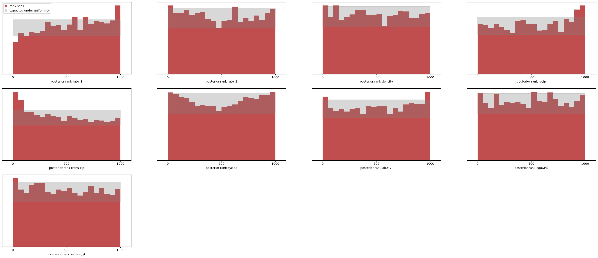
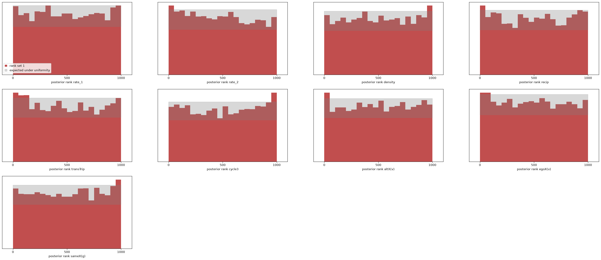
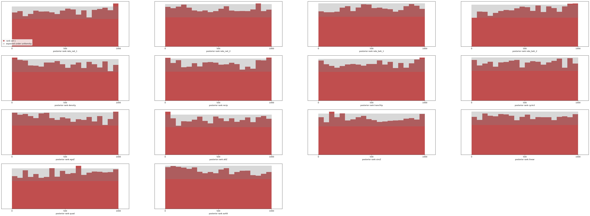
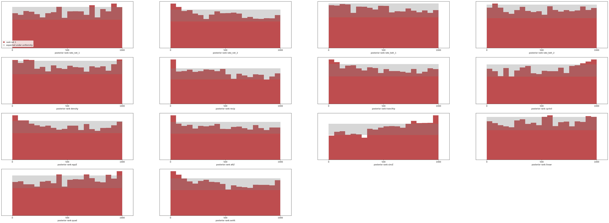
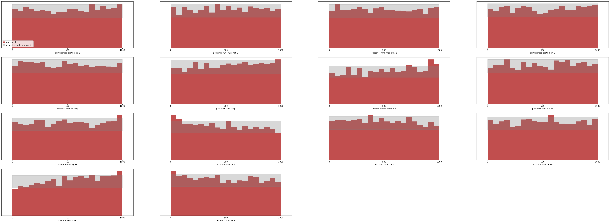

# M4 step 1: one estimator for n ≤ 200, and the Glasgow panel

Run 2026-09-14/16 on the Spark. Artefacts in `data/`: `train_m4.npz` (252 MB,
Spark only), `npe_m4.pt`, `npe_m4_sbc.{npz,png}` (2,000 held-out training
draws), `npe_m4_sbc_pop.{npz,png}` (4,000 fresh draws), `npe_m4_posterior_s50.npz`
(the Glasgow posterior, despite the name), `npe_m4_report.txt`, `m4_sbc.log`.
Real data and RSiena fits in `benchmarks/glasgow/`.

M4 is the application milestone: many networks at once, at sizes existing tools
handle one fit at a time. Step 1 asks whether the M3a estimator (three waves,
per-period rates, seven effects) simply extends from n ≤ 80 to n ≤ 200 with the
population widened and nothing else changed, and what it says about a real
school-year network of 129 pupils. The answer is: calibration yes, the real
network only partly — and the part that fails points at the population design,
not the estimator.

## Set-up

| | |
|---|---|
| θ | rate₁, rate₂ (each **U(1, 20)**, was U(1, 12)) + the seven M2 effects: 9 parameters |
| population | M2/M3a population with **n ~ U{20..200}** (was 20..80); starts, covariates and effects unchanged (`docs/PRIORS_M2.md`) |
| training set | 10⁶ three-wave panels, seed 70, summary-only (`--no-networks`), **13,376 s (75 panels/s)** — 18× slower than the n ≤ 80 set, as the n² kernel predicts |
| summaries | 42, as M3a |
| estimator | NSF 8 × 128, batch 1024, lr 5e-4; 190 epochs, 207.6 min; best validation loss −2.919 |
| Glasgow fit time | **0.12 s** per posterior against RSiena's 219 s (three-wave network model, one run to convergence) |

`saomsim.population` now takes `n_range` above `N_MAX` when networks are not
kept (`keep_networks=False`); `generate_m2.py`, `npe_m2.py` and `sbc_m2.py`
expose `--n-max` and `--rate-max`.

## Calibration across the population (fresh 4,000 draws, n ∈ [20, 200])

| parameter | KS p | mean rank | 50 % | 80 % | 90 % | 95 % |
|---|---|---|---|---|---|---|
| rate₁ | < 0.001 | 0.537 | 0.510 | 0.798 | 0.896 | 0.944 |
| rate₂ | 0.007 | 0.491 | 0.480 | 0.781 | 0.885 | 0.939 |
| density | 0.209 | 0.494 | 0.498 | 0.793 | 0.891 | 0.944 |
| recip | < 0.001 | 0.519 | 0.480 | 0.770 | 0.883 | 0.939 |
| transTrip | < 0.001 | 0.464 | 0.475 | 0.765 | 0.875 | 0.932 |
| cycle3 | 0.006 | 0.502 | 0.466 | 0.777 | 0.886 | 0.946 |
| altX(v) | 0.015 | 0.508 | 0.478 | 0.776 | 0.878 | 0.941 |
| egoX(v) | 0.791 | 0.500 | 0.503 | 0.789 | 0.887 | 0.939 |
| sameX(g) | 0.018 | 0.488 | 0.492 | 0.794 | 0.889 | 0.940 |
| binomial s.e. | | 0.005 | 0.008 | 0.006 | 0.005 | 0.003 |

- **Coverage nominal within 1.5–3.5 points for all nine parameters** across the
  whole size range (worst: transTrip 80 % at 0.765 and 90 % at 0.875 — the
  posterior a little too narrow on closure, as in every 10⁶ model here). The
  2,000 held-out training draws agree (`npe_m4_report.txt`).
- Two tilts survive the widening and are the same size in every n band:
  **rate₁ reads low (mean rank 0.53–0.55 from n 20 to n 200)** and transTrip
  reads high (0.45–0.47). Both are ≈ 0.1 sd; neither grows with n.
- No other drift with size. By band (30-wide bands, 300–1,000 draws each) the
  remaining seven parameters stay within 0.47–0.53 up to and including n = 200.
- The population SBC itself: 4,000 × 1,000 posterior samples in **83 s** once
  drawn in chunks of 100 observations with bounded rejection
  (`benchmarks.coverage.sbc_ranks_chunked`). The first attempt with sbi's
  `run_sbc` ran four hours and died in a GPU out-of-memory event while sharing
  the Spark with a training job — it draws all 4 million samples at once, and
  its rejection sampler loops without bound on an observation whose posterior
  sits almost wholly outside the prior box (one of the 4,000 here).

## Real data: Glasgow Teenage Friends and Lifestyle Study, three waves, n = 129

The full Glasgow panel (Michell & West; Pearson & West), of which s50 is the
familiar 50-girl excerpt: 160 pupils in one Scottish secondary school, followed
over three years (1995–97), each naming up to six best friends. We keep the 129
pupils present at all three waves (RSiena's `selection129`), dichotomise
"best friend" and "just a friend" as a tie, and use v = alcohol at wave 1
(centred) and g = sex, so the M3a effect set applies unchanged. 26 pupils lack
an alcohol value in some wave; saomsim has no missing-data handling, so both
RSiena and saomsim see the same completed matrix (nearest observed wave carried
forward, else backward; `benchmarks/glasgow/prepare_and_fit.R`). Ties per wave
449, 445, 464 (tie fraction 0.027, mean out-degree 3.5); 478 and 437 tie
changes across the two periods; Jaccard stability 0.30 and 0.35.

| parameter | RSiena est ± se | M4 mean ± sd | M4 90 % | (RS − M4)/sd |
|---|---|---|---|---|
| **rate₁** | **10.71 ± 1.01** | **7.70 ± 0.82** | [6.58, 9.11] | **3.67** |
| **rate₂** | **9.04 ± 0.75** | **7.45 ± 0.66** | [6.45, 8.60] | **2.41** |
| density | −3.36 ± 0.10 | −3.14 ± 0.10 | [−3.32, −2.97] | −2.16 |
| recip | 2.25 ± 0.11 | 2.39 ± 0.14 | [2.16, 2.61] | −0.98 |
| transTrip | 0.62 ± 0.04 | 0.61 ± 0.06 | [0.51, 0.71] | 0.21 |
| cycle3 | −0.42 ± 0.08 | −0.42 ± 0.12 | [−0.61, −0.23] | 0.07 |
| altX(v) | −0.01 ± 0.03 | 0.03 ± 0.05 | [−0.04, 0.10] | −0.88 |
| egoX(v) | −0.01 ± 0.04 | −0.04 ± 0.04 | [−0.11, 0.03] | 0.62 |
| sameX(g) | 0.89 ± 0.10 | 0.68 ± 0.12 | [0.49, 0.89] | 1.69 |

- **Five of nine on RSiena** (|z| < 1): recip, transTrip, cycle3 and the two
  alcohol covariate effects. The structural story of the network — strong
  reciprocity, transitive closure, negative three-cycles, no alcohol selection
  in the friendship model — is the same from both estimators, in 0.12 s
  against 219 s.
- **Both rates read low by a quarter** (7.7 vs 10.7, 7.5 vs 9.0; 3.7 and 2.4
  sd), density reads 0.2 high (2.2 sd) and same-sex selection 0.2 low (1.7 sd).
  The rate direction matches the population tilt above, but the size does not:
  the SBC tilt is 0.1 sd, this is 3.7. Something specific to Glasgow is doing
  most of it.

### Where Glasgow sits in the training population

Percentile of each Glasgow summary among the 250,432 training panels with
n ∈ [110, 150] (`/tmp/glasgow_screen.py` on the Spark, 2026-09-16):

| summary | Glasgow | percentile | band median |
|---|---|---|---|
| x0 tie fraction | 0.027 | 0.055 | 0.116 |
| x0 out-degree sd | 1.63 | **0.019** | 4.04 |
| x0 in-degree sd | 2.27 | 0.094 | 4.09 |
| x0 isolates | 2 | 0.961 | 0 |
| x1 changes | 478 | 0.157 | 1,189 |
| x1 out-degree sd | 1.51 | **0.019** | 5.25 |
| x2 tie fraction | 0.028 | 0.090 | 0.181 |
| g categories | 2 | (minimum) | 3 |

Glasgow is inside the training support on every summary but sits in a thinly
populated corner of it: **a sparse network with nearly uniform out-degrees.**
The population's starts draw a tie fraction d ~ U(0.02, 0.20) regardless of n
(`docs/PRIORS_M2.md`), a choice made for n ≤ 80 where it spans mean degrees
of 0.4–16. At n = 129 the same range gives mean degrees 2.6–26 with a median of
15 — four times the Glasgow network — and the SAOM burn-in that structures half
the starts has no cap on out-degree, whereas Glasgow pupils named at most six
friends (out-degree sd 1.6 against a training median of 4.0). Roughly 5 % of
same-size training panels look like Glasgow on density and 2 % on degree
spread; the estimator has been shown a few thousand such panels, not a few
hundred thousand.

That is where the rate under-read comes from. The rate is read off the change
counts (478, 437) against what the population associates with that many changes
at n ≈ 130; in a dense population the same count of changes is a smaller
per-actor rate. Among training panels in the band, the median x1 change count
is 1,314 at rate₁ ≈ 10.7 and 958 at rate₁ ≈ 7.7 — both far above Glasgow's 478,
because both are computed over networks four times denser. The estimator does
the honest thing with an input at the edge of what it has seen: it shrinks
toward the population. Density (read high, i.e. less negative, on a sparse
network) and same-sex selection fit the same reading.

Two implications, one for the paper and one for step 2:

1. **Calibration across a population is necessary, not sufficient.** The
   estimator is calibrated over its population at every n, including 129, and
   still mis-reads a real network at that n because the population's *shape*
   at large n does not match real school networks. The in-distribution screen
   (`docs/OOD_RESULTS.md`) catches it — the degree-sd summaries flag at the
   2 % tail — which is exactly what the screen is for.
2. **The population for n > 80 must hold mean degree, not tie fraction, fixed.**
   Real friendship networks have mean degrees of 2–8 across sizes; tie fraction
   falls as 1/n. Step 2's population should draw d ~ U(2/n, 10/n) (or a mixture
   with the current range for continuity at small n), and should include an
   out-degree-capped nomination regime, since most school surveys cap
   nominations. That is a `sample_start_networks` change plus a regeneration,
   ≈ 4 h at n ≤ 200; the estimator, summaries and training loop are untouched.

## What this establishes

- The M3a estimator scales to n ≤ 200 with no architectural change: 10⁶ panels,
  3.5 h of training, coverage nominal within 3.5 points everywhere, no drift
  with n. The cost that scales is generation (18× the n ≤ 80 set), as
  `docs/SCALING.md` anticipates.
- On the Glasgow panel it agrees with RSiena on the structural effects and
  reads the rates low, and the reason is diagnosable from the training set
  alone: the start-network population is dense relative to real school
  networks at this size. This is the first real-data result here that the
  population design, rather than the training budget, limits — the 10⁷ runs
  fixed the s50 rate under-reads because s50 sits in the middle of the
  population; Glasgow sits at its edge.

## Step 2: the sparse-start population (2026-09-16)

Design: `docs/PRIORS_M4.md`. One change — half the start networks draw a mean
degree k ~ U(2, 10) instead of a tie fraction, and half of those are capped at
ceil(k) + U{1..3} out-ties per actor. Artefacts: `train_m4b.npz` (Spark),
`npe_m4b.*`, `npe_m4b_sbc_pop.{npz,png}`, `npe_m4b_report.txt`, `m4b.log`.

| | |
|---|---|
| training set | 10⁶ panels, seed 71, **9,511 s (105 panels/s)** — faster than step 1's 75/s, sparser starts being cheaper to update |
| estimator | NSF 8 × 128, batch 1024, lr 5e-4; 217 epochs, ≈ 110 min; best validation loss −3.193 (not comparable with step 1's −2.919: different population) |
| Glasgow | 0.06 s |

### Calibration (fresh 4,000 draws from the sparse population, n ∈ [20, 191])

| parameter | KS p | mean rank | 50 % | 80 % | 90 % | 95 % |
|---|---|---|---|---|---|---|
| rate₁ | 0.555 | 0.499 | 0.493 | 0.782 | 0.887 | 0.941 |
| rate₂ | < 0.001 | 0.480 | 0.493 | 0.794 | 0.890 | 0.940 |
| density | 0.183 | 0.506 | 0.494 | 0.789 | 0.885 | 0.933 |
| recip | 0.045 | 0.498 | 0.479 | 0.778 | 0.884 | 0.941 |
| transTrip | 0.001 | 0.487 | 0.477 | 0.772 | 0.881 | 0.935 |
| cycle3 | 0.004 | 0.509 | 0.470 | 0.773 | 0.884 | 0.934 |
| altX(v) | 0.456 | 0.500 | 0.499 | 0.788 | 0.887 | 0.940 |
| egoX(v) | 0.102 | 0.489 | 0.494 | 0.788 | 0.889 | 0.942 |
| sameX(g) | 0.041 | 0.508 | 0.483 | 0.780 | 0.885 | 0.937 |
| binomial s.e. | | 0.005 | 0.008 | 0.006 | 0.005 | 0.003 |

- **Coverage nominal within 3 points for all nine**, over a wider population
  than step 1 — the estimator absorbed the extra input range at the same 10⁶
  budget. No observation needed clamped draws.
- The step-1 rate₁ tilt (0.53–0.55 in every band) is **gone** (0.499; by band
  0.487–0.512). transTrip's closure tilt shrank from 0.464 to 0.487.
- One new tilt: rate₂ reads slightly high at large n (mean rank 0.435–0.44 for
  n ≥ 140, ≈ 0.15 sd), where step 1 had it at 0.47. Coverage there is still
  nominal. Worth watching, not acting on.

### Glasgow, three waves, n = 129: step 1 vs step 2

| parameter | RSiena est ± se | step 1 (dense starts) | z₁ | **step 2 (sparse starts)** | **z₂** |
|---|---|---|---|---|---|
| **rate₁** | 10.71 ± 1.01 | 7.70 ± 0.82 | 3.67 | **9.11 ± 1.77** [7.29, 11.78] | **0.90** |
| **rate₂** | 9.04 ± 0.75 | 7.45 ± 0.66 | 2.41 | **7.89 ± 0.75** [6.77, 9.16] | **1.53** |
| density | −3.36 ± 0.10 | −3.14 ± 0.10 | −2.16 | −3.20 ± 0.10 [−3.36, −3.05] | −1.72 |
| recip | 2.25 ± 0.11 | 2.39 ± 0.14 | −0.98 | **2.25 ± 0.12** [2.05, 2.45] | 0.01 |
| transTrip | 0.62 ± 0.04 | 0.61 ± 0.06 | 0.21 | 0.61 ± 0.05 [0.52, 0.70] | 0.23 |
| cycle3 | −0.42 ± 0.08 | −0.42 ± 0.12 | 0.07 | −0.39 ± 0.10 [−0.54, −0.22] | −0.31 |
| altX(v) | −0.01 ± 0.03 | 0.03 ± 0.05 | −0.88 | 0.03 ± 0.04 [−0.04, 0.10] | −0.80 |
| egoX(v) | −0.01 ± 0.04 | −0.04 ± 0.04 | 0.62 | 0.03 ± 0.04 [−0.04, 0.10] | −1.07 |
| sameX(g) | 0.89 ± 0.10 | 0.68 ± 0.12 | 1.69 | 0.71 ± 0.12 [0.52, 0.90] | 1.54 |

(z = (RSiena − ours) / our sd; 90 % intervals for step 2 in brackets.)

- **All nine RSiena estimates now lie inside the 90 % intervals; max |z| 1.72**
  (was 3.67). The rate under-read is resolved by the population change alone:
  rate₁ moved from 3.7 sd to 0.9 sd of RSiena, rate₂ from 2.4 to 1.5, density
  from 2.2 to 1.7, with no change to the estimator, summaries or budget.
- The rate₁ posterior is also **twice as wide** (sd 1.77 vs 0.82) and now
  matches RSiena's standard error more closely than step 1 did (1.01). Step
  1's narrow interval was over-confidence at the edge of its population — the
  in-distribution screen would have flagged it, the calibration table could
  not. Step 2 puts Glasgow inside the population and the interval widens to
  what the data support.
- Reciprocity lands on RSiena to two decimals; transTrip, cycle3 and altX are
  unchanged and on. sameX(g) and density remain 1.5–1.7 sd off in the same
  direction as before — small, but consistent across both fits, so probably
  not noise. Both are effects that the out-degree cap in the later waves
  could bias (a capped actor cannot add the same-sex tie the model wants);
  the design note lists this as the next suspect.

What this settles: the step-1 failure was the population's shape, as
diagnosed, and the fix was cheap — a start prior that keeps mean degree
rather than tie fraction fixed as n grows. The estimator for n ≤ 200 is now
calibrated over a population that contains real school networks and agrees
with RSiena on all nine parameters of the Glasgow panel in 0.06 s.

## Co-evolution on Glasgow: network × alcohol, n = 129 (2026-09-18)

The M3b estimator (14 parameters, `docs/PRIORS_M3b.md`) on the step-2
population: n ~ U{20..200}, sparse-start regime, rate_net ~ U(1, 20). Code:
`npe_coev.py generate/sbc --n-max 200 --rate-net-max 20 --start sparse`,
`npe_coev.py s50 --real glasgow`. Artefacts `train_coev_m4.npz` (Spark),
`npe_coev_m4.*`, `npe_coev_m4_sbc_pop.{npz,png}`, `npe_coev_m4_posterior_{glasgow,s50}.npz`,
`coev_m4.log`.

| | |
|---|---|
| training set | 10⁶ panels, seed 80, 11,685 s (86 panels/s) |
| estimator | NSF 8 × 128, batch 1024, lr 5e-4; 176 epochs, ≈ 90 min; best validation loss 2.307 |
| Glasgow / s50 | 0.5 s each |

### Calibration (fresh 4,000 draws, n ∈ [21, 199])

**Coverage within 1.7 points of nominal on all 14** (worst: recip 90 % at
0.883); mean ranks 0.483–0.521; no drift with n (avAlt 0.47–0.51 across the
bands, rate_beh₂ 0.50–0.53). The 14-parameter estimator extends to n ≤ 200 as
the network-only one did.

### Glasgow (RSiena co-evolution fit: `benchmarks/glasgow/rsiena_coevolution.json`, 287 s)

| parameter | RSiena est ± se | M4 mean ± sd | M4 90 % | (RS − M4)/sd |
|---|---|---|---|---|
| **rate_net₁** | 10.57 ± 0.90 | **8.40 ± 0.95** | [7.02, 10.03] | **2.28** |
| **rate_net₂** | 8.58 ± 0.80 | **6.86 ± 0.57** | [5.96, 7.84] | **3.01** |
| rate_beh₁ | 1.12 ± 0.20 | 1.23 ± 0.22 | [0.92, 1.61] | −0.52 |
| rate_beh₂ | 1.72 ± 0.28 | 2.32 ± 0.50 | [1.68, 3.22] | −1.21 |
| density | −2.77 ± 0.06 | −2.74 ± 0.08 | [−2.87, −2.62] | −0.38 |
| recip | 2.42 ± 0.11 | 2.43 ± 0.14 | [2.21, 2.66] | −0.04 |
| transTrip | 0.67 ± 0.05 | 0.55 ± 0.07 | [0.43, 0.66] | 1.69 |
| cycle3 | −0.51 ± 0.09 | −0.29 ± 0.16 | [−0.53, −0.01] | −1.39 |
| egoZ | 0.01 ± 0.05 | 0.04 ± 0.08 | [−0.09, 0.16] | −0.43 |
| altZ | 0.06 ± 0.05 | −0.06 ± 0.10 | [−0.21, 0.10] | 1.27 |
| **simZ (selection)** | **1.16 ± 0.32** | **2.03 ± 0.47** | [1.33, 2.88] | **−1.83** |
| linear | 0.44 ± 0.14 | 0.56 ± 0.24 | [0.21, 1.00] | −0.50 |
| quad | −0.56 ± 0.20 | −0.87 ± 0.20 | [−1.22, −0.55] | 1.50 |
| **avAlt (influence)** | **1.35 ± 0.59** | **2.63 ± 0.76** | [1.37, 3.83] | **−1.70** |

- **Nine of fourteen inside the 90 % intervals.** Density, reciprocity, the
  behaviour rates, egoZ, altZ and linear are on RSiena. Both mechanisms are
  recovered as present, as RSiena finds them.
- **The network rates read low again** (z 2.3, 3.0) — the sparse population
  that fixed this for the network-only estimator did not fix it here. The s50
  fit from the same model (below) shows the 10⁶-budget rate under-read that
  the M3b 10⁶ model had and the 10⁷ model removed, so part of this is budget:
  the co-evolution population is far wider than the network one (n to 200,
  two start regimes, three behaviour scales, rates to 20) on the same 10⁶
  panels.
- **Selection and influence both read high** (simZ 2.03 vs 1.16, avAlt 2.63 vs
  1.35, 1.7–1.8 sd), the direction the influence/quad pair took on s50 in
  every fit (`docs/M3_RESULTS.md`).

### Where Glasgow and s50 sit in the co-evolution population

The screen of §"Where Glasgow sits" above, on the 62 co-evolution summaries
against same-size training panels with z_max = 5 (57,344 for Glasgow, 77,824
for s50; `/tmp/coev_screen.py` on the Spark):

| summary | s50 obs | pctile | Glasgow obs | pctile | band median |
|---|---|---|---|---|---|
| **x0_simZ** (friends' alcohol similarity, wave 1) | 10.0 | **0.982** | 28.2 | **0.989** | 0.01 / 0.04 |
| x0_egoZ (drinkers' out-ties, wave 1) | −17.8 | 0.091 | −129.3 | **0.003** | 0 |
| sim_mean (RSiena constant) | 0.674 | **0.013** | 0.726 | 0.179 | 0.76 |
| x1_simZ | 13.5 | 0.879 | 36.9 | 0.855 | 1.3 / 5.4 |
| x0_tie_fraction | 0.046 | 0.200 | 0.027 | 0.176 | 0.12 / 0.07 |

Density is now inside the population for both (step 2 did its job), and the
behaviour-shape summaries are central. What is at the edge is **the alignment
of network and behaviour at the start**: real friendship networks are already
homophilous on drinking at wave 1 — friends drink alike, the product of
selection and influence before the panel began — and the population's start
networks are not. `_start_networks` draws X0 by ER or a burn-in under the
structural effects only, and z0 independently, so x0_simZ is ≈ 0 for every
training panel; s50 and Glasgow sit at its 98th–99th percentile. The
estimator reads the later-wave alignment against a start that has none and
must attribute all of it to selection and influence acting within the
periods, where in the real data much of it was there at the start. That is
the same failure as the density one in step 1, on the behaviour axis, and it
is the likeliest reason every real-data co-evolution fit here has put
selection and influence above RSiena.

The step-3 population, by the same recipe as step 2: burn the start network
in **under the selection effects as well** — `simulate_coevolution` from the ER
seed with θ₀ ~ prior on the structural and selection effects and rate_beh = 0,
so z0 is fixed and X0 acquires the homophily the prior implies — which puts
x0_simZ across a realistic range at no cost to anything else. One regime
flag, a regeneration (3 h) and a retrain (1.5 h).

### s50 from the same model (for comparison with `docs/M3_RESULTS.md`)

All 14 RSiena estimates inside the 90 % intervals; max |z| 1.62 (rate_net₁,
the 10⁶ under-read); avAlt 2.53 ± 0.84 (z −1.43), quad −0.85 ± 0.27 (z 0.92),
simZ 1.85 ± 0.70 (z −0.62). The wider population costs s50 nothing in
coverage and a little in width (sd 0.84 vs 0.81 on avAlt).

## Step 3: starts with behaviour homophily (2026-09-18)

`start="homophilous"` (`population_coev._start_networks`): the sparse density
mixture of step 2, and the burnt-in half of the starts evolves under the
structural *and selection* effects with the behaviour frozen
(`simulate_coevolution`, θ₀ ~ prior on both, rate_beh = 0). Glasgow's x0_simZ
moves from the 99th percentile of the population to about the 75th; on the
new screening reference every one of its 62 summaries is inside the 2nd–98th
(`fit.py`). Artefacts `train_coev_m4b.npz` (Spark), `npe_coev_m4b.*`,
`npe_coev_m4b_posterior_{glasgow,s50}.npz`, `coev_m4b.log`,
`models/screen_coev_m4b.npz`.

| | |
|---|---|
| training set | 10⁶ panels, seed 81, 12,232 s (82 panels/s) |
| estimator | NSF 8 × 128, batch 1024, lr 5e-4; 233 epochs, ≈ 2 h; best validation loss 2.525 (step 2: 2.307 — a harder population) |

### Calibration (fresh 4,000 draws, n ∈ [30, 197])

Coverage within 3 points of nominal on all 14 (90 %: 0.879–0.898), but the
population is visibly harder at this budget: KS rejects eleven of fourteen,
and **simZ reads low by ≈ 0.1 sd throughout** (mean rank 0.544; 0.52–0.56 in
every n band), with cycle3 (0.522), quad (0.519), avAlt (0.474) and recip
(0.471) tilted the other way. Separating within-period selection from the
homophily the start already carries is exactly the harder task this population
poses, and 10⁶ panels do not fully learn it. The 10⁶ → 10⁷ step removed tilts
of this size in every previous model.

### Glasgow, step 2 → step 3

| parameter | RSiena est ± se | step 2 | z₂ | **step 3** | **z₃** |
|---|---|---|---|---|---|
| rate_net₁ | 10.57 ± 0.90 | 8.40 ± 0.95 | 2.28 | **9.12 ± 1.14** | **1.27** |
| rate_net₂ | 8.58 ± 0.80 | 6.86 ± 0.57 | 3.01 | **7.22 ± 0.72** | **1.90** |
| rate_beh₁ | 1.12 ± 0.20 | 1.23 ± 0.22 | −0.52 | 1.44 ± 0.32 | −1.00 |
| rate_beh₂ | 1.72 ± 0.28 | 2.32 ± 0.50 | −1.21 | 2.68 ± 0.74 | −1.29 |
| density | −2.77 ± 0.06 | −2.74 ± 0.08 | −0.38 | −2.68 ± 0.10 | −0.89 |
| recip | 2.42 ± 0.11 | 2.43 ± 0.14 | −0.04 | 2.31 ± 0.11 | 0.99 |
| transTrip | 0.67 ± 0.05 | 0.55 ± 0.07 | 1.69 | 0.53 ± 0.07 | 2.16 |
| cycle3 | −0.51 ± 0.09 | −0.29 ± 0.16 | −1.39 | −0.19 ± 0.12 | −2.58 |
| egoZ | 0.01 ± 0.05 | 0.04 ± 0.08 | −0.43 | 0.06 ± 0.09 | −0.63 |
| altZ | 0.06 ± 0.05 | −0.06 ± 0.10 | 1.27 | −0.08 ± 0.09 | 1.49 |
| **simZ (selection)** | 1.16 ± 0.32 | 2.03 ± 0.47 | −1.83 | **2.05 ± 0.70** | **−1.27** |
| linear | 0.44 ± 0.14 | 0.56 ± 0.24 | −0.50 | 0.40 ± 0.20 | 0.22 |
| quad | −0.56 ± 0.20 | −0.87 ± 0.20 | 1.50 | −0.96 ± 0.26 | 1.55 |
| **avAlt (influence)** | 1.35 ± 0.59 | 2.63 ± 0.76 | −1.70 | **2.45 ± 0.79** | **−1.40** |

- **Eleven of fourteen inside the 90 % intervals** (nine before). The two
  predicted moves happened: the network rates came up (z 2.3 → 1.3, 3.0 →
  1.9) and selection and influence moved toward RSiena (z −1.8 → −1.3, −1.7
  → −1.4), mainly by widening — the posterior now admits that start homophily
  and within-period selection trade off.
- **Closure got worse**: transTrip 0.53 (z 2.2) and cycle3 −0.19 (z −2.6),
  both read toward zero. Not a trade-off with selection: in the joint
  posterior closure and simZ are uncorrelated (|r| ≤ 0.1 in both steps), and
  conditioning simZ on RSiena's value moves transTrip and cycle3 by < 0.03.
  The network-only estimator reads closure on RSiena from the same network
  block (step 2), so the co-evolution estimator's read is its own — the
  wider population at the same 10⁶ budget, on which the SBC already shows a
  cycle3 tilt. What the joint posterior does show is a **strong
  selection–density coupling** (r = −0.75; −0.61 in step 2): on Glasgow the
  estimator cannot fully separate "many same-drinking ties" from "many ties",
  which is also where its density read (−2.68 vs −2.77) comes from.

### s50 from the same model: the influence/quad pair does not move

All 14 inside the 90 % intervals, max |z| 1.56 (transTrip). **avAlt 2.48 ±
0.92 (z −1.26), quad −1.02 ± 0.31 (z 1.37)** — against 2.70 / −1.00 at 10⁶,
2.72 / −1.05 at 10⁷, 2.53 / −0.85 at step 2. Four populations, three
budgets, the same pair to within 0.3 sd. The start-homophily hypothesis for
*that* offset is therefore falsified: on s50 it is a property of the
summaries-plus-flow reading of these 50 actors, not of where s50 sits in the
population. The PPC (`docs/M3_RESULTS.md`) says the data cannot separate it
from MoM or ML, so it stands as a documented, stable, sub-2-sd difference in
a direction the data do not identify well.

### What step 3 settles, and what it does not

Start homophily was real and its removal helped the rates and the
selection/influence reads on Glasgow, but it was not the whole story, and it
made closure worse. Two things remain open and are separable:

1. **Budget.** The co-evolution population is now very wide (n to 200, two
   density regimes, homophilous starts, three behaviour scales, rates to 20)
   on the same 10⁶ panels, and the SBC shows 0.1-sd tilts on six parameters.
   A 10⁷ set on this population is the principled fix — ten shards at 3.4 h
   each plus ~18 h of training, two days of Spark — and the pattern that 10⁷
   removes the 10⁶ tilts has held three times.
2. **Closure on Glasgow.** Checked: not a selection trade-off (above). A
   network-only fit on the same panel reads closure on RSiena, so this is
   the co-evolution estimator under-trained on a wider population — the same
   item as 1.

`fit.py` used the step-3 model by default until the 10⁷ estimator below.

## Step 3 at 10⁷ (2026-09-21)

Same population, ten times the panels: ten shards (seeds 90–99,
`npe_coev.py generate --start homophilous`, 3.1–3.4 h each, 82–89 panels/s,
34 h in all on the Spark), trained at the 10⁶ settings. Artefacts
`data/coev_m4_shards/` (Spark), `npe_coev_m4_10m.*`,
`npe_coev_m4_10m_posterior_{glasgow,s50}.npz`, `coev_m4_10m.log`; the
screening reference is unchanged (`models/screen_coev_m4b.npz`, same
population). `fit.py` now tries this model first.

| | |
|---|---|
| training set | 10⁷ panels, seeds 90–99, 62 summaries |
| estimator | NSF 8 × 128, batch 1024, lr 5e-4; 257 epochs, 23.0 h; best validation loss 0.894 at epoch 237 (step 3 at 10⁶: 2.525) |

### Calibration (fresh 4,000 draws, n ∈ [30, 197])

**Coverage within 1.1 points of nominal on all 14** (90 %: 0.889–0.906; 95 %:
0.941–0.956). The simZ tilt is gone (mean rank 0.544 → 0.489; 0.46–0.51 in
every n band), and so are cycle3 (0.522 → 0.505) and recip's under-read
(0.471 → 0.515). KS rejects six of fourteen instead of eleven, on tilts of
0.02–0.03: transTrip 0.522, quad 0.534, altZ 0.473, avAlt 0.486, recip
0.515, rate_net₁ 0.508. quad is the one that did not improve (0.519 →
0.534, rising to 0.55 at n ≥ 170). The 10⁶ → 10⁷ step did what it did on
the three previous populations: the 0.1-sd tilts went, and what is left is
at the resolution of 4,000 draws.

### Glasgow, step 3 at 10⁶ → 10⁷

| parameter | RSiena est ± se | 10⁶ | z | **10⁷** | **z** |
|---|---|---|---|---|---|
| rate_net₁ | 10.57 ± 0.90 | 9.12 ± 1.14 | 1.27 | 9.18 ± 0.88 | 1.58 |
| rate_net₂ | 8.58 ± 0.80 | 7.22 ± 0.72 | 1.90 | **7.98 ± 0.89** | **0.68** |
| rate_beh₁ | 1.12 ± 0.20 | 1.44 ± 0.32 | −1.00 | 1.42 ± 0.27 | −1.11 |
| rate_beh₂ | 1.72 ± 0.28 | 2.68 ± 0.74 | −1.29 | 2.36 ± 0.54 | −1.17 |
| density | −2.77 ± 0.06 | −2.68 ± 0.10 | −0.89 | **−2.83 ± 0.09** | **0.61** |
| recip | 2.42 ± 0.11 | 2.31 ± 0.11 | 0.99 | 2.36 ± 0.13 | 0.51 |
| transTrip | 0.67 ± 0.05 | 0.53 ± 0.07 | 2.16 | **0.60 ± 0.06** | **1.07** |
| cycle3 | −0.51 ± 0.09 | −0.19 ± 0.12 | −2.58 | **−0.44 ± 0.12** | **−0.60** |
| egoZ | 0.01 ± 0.05 | 0.06 ± 0.09 | −0.63 | −0.07 ± 0.09 | 0.94 |
| altZ | 0.06 ± 0.05 | −0.08 ± 0.09 | 1.49 | −0.01 ± 0.10 | 0.67 |
| **simZ (selection)** | 1.16 ± 0.32 | 2.05 ± 0.70 | −1.27 | **2.09 ± 0.52** | **−1.78** |
| linear | 0.44 ± 0.14 | 0.40 ± 0.20 | 0.22 | 0.44 ± 0.19 | −0.03 |
| quad | −0.56 ± 0.20 | −0.96 ± 0.26 | 1.55 | **−1.05 ± 0.27** | **1.80** |
| **avAlt (influence)** | 1.35 ± 0.59 | 2.45 ± 0.79 | −1.40 | **2.82 ± 0.75** | **−1.96** |

- **Closure is fixed**, as the step-3 diagnosis said it would be: transTrip
  0.60 (z 1.1) and cycle3 −0.44 (z −0.6), both well inside the 90 %
  intervals. Density moved onto RSiena (−2.83, z 0.6) and rate_net₂ came up
  (z 1.9 → 0.7). The whole structural block — density, recip, transTrip,
  cycle3, egoZ, altZ — is now within 1.1 sd, at the same posterior widths
  as 10⁶.
- **Selection and influence did not move toward RSiena.** Still eleven of
  fourteen inside, but the three outside are now simZ 2.09 ± 0.52 (z −1.8),
  avAlt 2.82 ± 0.75 (z −2.0) and quad −1.05 ± 0.27 (z 1.8). The 10⁶ step-3
  reads (2.05 / 2.45 / −0.96) were the same numbers with wider intervals;
  the step-2 reads (2.03 / 2.63 / −0.87) too; only the simZ interval
  changed, narrowing from ± 0.70 to ± 0.52. Across three budgets and two
  start regimes the estimator reads Glasgow's selection at ≈ 2.0 and its
  influence at ≈ 2.5–2.8 against RSiena's 1.16 and 1.35, and the 10⁷ model
  says so with more confidence. The joint posterior keeps the same shape:
  selection × density r = −0.68 (−0.75 at 10⁶), selection × influence
  −0.16, influence × quad −0.93, closure × selection |r| ≤ 0.1.

### s50 from the same model

All 14 inside the 90 % intervals, max |z| 1.58 (avAlt). **avAlt 2.70 ±
0.87 (z −1.58), quad −1.06 ± 0.33 (z 1.40)** — against 2.48 / −1.02 at step
3 with 10⁶, 2.70 / −1.00 at M3b 10⁶, 2.72 / −1.05 at M3b 10⁷, 2.53 / −0.85
at step 2. Fifth estimator, same pair to within 0.3 sd. simZ 1.99 ± 0.74
(z −0.8), selection on RSiena as before.

### What the 10⁷ run settles

1. **The population was under-trained at 10⁶, and closure was the symptom.**
   Budget fixed the SBC tilts and the Glasgow closure reads; this is the
   fourth population on which the 10⁶ → 10⁷ step has done exactly that, and
   the pattern can now be taken as the rule: a new population is not judged
   at 10⁶.
2. **The Glasgow selection/influence offset is not a budget effect and not a
   start-regime effect.** It is the same 0.9 / 1.4 gap (in RSiena units) at
   every budget and in both start regimes, and it is the same *pair* that is
   stable on s50 — with quad tied to influence at r = −0.93 in both panels.
   What remains open is which side of the gap is right. On s50 the ML fit
   and the PPC (`docs/M3_RESULTS.md`) could not resolve it; Glasgow, with
   129 actors, has more information, and an RSiena maximum-likelihood fit
   and a behaviour-statistic PPC on Glasgow are the two checks that can
   place the truth. That is the next co-evolution item, ahead of any further
   population change.

## The Glasgow maximum-likelihood fit (2026-09-24)

`benchmarks/glasgow/rsiena_coevolution_maxlike.R`: the same 14-parameter model
fitted by likelihood (MCMC) instead of the method of moments, started from the
MoM estimate. **76.4 hours on one core** (four `siena07` runs of 19.3, 19.4,
18.9 and 18.9 h), `n3 = 3000`, `mult = 5`. Result in
`benchmarks/glasgow/rsiena_coevolution_maxlike.json`, log `data/glasgow_maxlike.log`.

**Convergence.** The overall ratio went 0.507 → 0.584 → 0.590 → **0.710**
across the four runs, never meeting RSiena's 0.25 guideline and drifting
upward; per-parameter t-ratios in the final run are ≤ 0.54 (density), all
others ≤ 0.42. Two standard errors came back `NA` in run 3, i.e. the
covariance estimate is losing positive-definiteness as the chains lengthen.
The point estimate, on the other hand, is extremely stable: across the four
runs selection moved 0.838 → 0.847 → 0.909 → 0.909, influence 0.438 → 0.405 →
0.407 → 0.401 and curvature −0.358 → −0.342 → −0.349 → −0.354. We therefore
report the ML point as **stable but not certified**, the same status as the
s50 ML fit (`docs/M3_RESULTS.md`), and note that `siena07`'s ML mode at
n = 129 is at the edge of its practical range.

**Three estimators on the same panel** (amortized = the 10⁷ step-3 estimator;
z compares ML with the posterior using both uncertainties):

| parameter | MoM | **ML** | amortized 10⁷ | z |
|---|---|---|---|---|
| rate_net₁ | 10.57 ± 0.90 | 9.91 ± 0.88 | 9.18 ± 0.88 | 0.59 |
| rate_net₂ | 8.58 ± 0.80 | 8.82 ± 0.77 | 7.97 ± 0.89 | 0.72 |
| density | −2.77 ± 0.05 | −2.83 ± 0.05 | −2.83 ± 0.09 | −0.02 |
| recip | 2.42 ± 0.11 | 2.27 ± 0.10 | 2.36 ± 0.13 | −0.54 |
| transTrip | 0.67 ± 0.05 | 0.71 ± 0.04 | 0.60 ± 0.06 | 1.44 |
| cycle3 | −0.51 ± 0.09 | −0.36 ± 0.08 | −0.44 ± 0.12 | 0.58 |
| egoZ | 0.01 ± 0.05 | −0.08 ± 0.04 | −0.07 ± 0.09 | −0.03 |
| altZ | 0.06 ± 0.05 | 0.10 ± 0.04 | −0.01 ± 0.10 | 0.98 |
| **simZ (selection)** | 1.16 ± 0.32 | **0.91 ± 0.22** | 2.08 ± 0.52 | **−2.09** |
| linear | 0.44 ± 0.14 | 0.40 ± 0.10 | 0.44 ± 0.19 | −0.21 |
| **quad** | −0.56 ± 0.19 | **−0.35 ± 0.08** | −1.05 ± 0.27 | **2.47** |
| **avAlt (influence)** | 1.34 ± 0.59 | **0.40 ± 0.21** | 2.82 ± 0.75 | **−3.09** |

- **On eleven of fourteen parameters ML and the amortized posterior agree**
  within 1.5 combined sd, and on the whole structural block within 1.0. The
  posterior's density read (−2.83) is ML's to two decimals, where MoM sits at
  −2.77.
- **On the influence/curvature/selection triple, ML lands on the far side of
  MoM from the posterior**, exactly as on s50: there ML gave avAlt 0.33 against
  MoM 1.33 and our 2.72; here 0.40 against 1.34 and 2.82. Two panels, 2.6×
  apart in size, produce the same ordering and nearly the same numbers.

**What this settles.** The offset reported since 2026-09-18 is not a property
of one dataset, one estimator or one training budget: three estimators lie
along a single ridge in (avAlt, quad) — the direction in which the joint
posterior has correlation −0.93 on both panels and −0.63 in every one of the
19 Baerveldt schools (`docs/M5_RESULTS.md`). MoM matches the target statistics
by construction; ML maximises a likelihood it cannot evaluate exactly and
whose convergence it cannot certify here; the amortized posterior reports the
whole ridge and its width. They disagree because the data do not determine a
point on that ridge, which is the substantive finding, not a defect in any of
the three.

What would settle *which* point is right is a posterior predictive check on
Glasgow's behaviour statistics under each of the three (`benchmarks/ppc_coev.py`,
which did this for s50 and could not separate them there). That is the next
co-evolution item.

Next: Glasgow PPC for the selection/influence/quad triple; Knecht classrooms
with `fit.py`; sparse simulator for n > 500.
