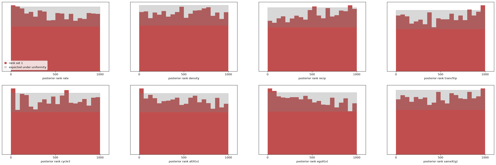

# M5: one estimator, nineteen schools

Design in `docs/PRIORS_M5.md`. The target is the Dutch Social Behavior study
(Baerveldt; Snijders & Baerveldt 2003): 19 school networks, two waves,
emotional-support ties, delinquency at both waves, sex. Data, per-school
RSiena fits and the `siena08` meta-analysis in `benchmarks/baerveldt/`
(`prepare_and_fit.R`, 2026-09-21). This is the first time the estimator is
asked for many real networks at once, and the first two-wave population since
M2.

## The network-only estimator (2026-09-22)

| | |
|---|---|
| population | `start="survey"`, n ~ U{30..100}, mean degree k ~ U(0.5, 6) on every start, half out-degree capped; two waves; rate U(1, 12); the M2 effect box |
| training set | 10⁶ panels, seed 100, 14 min on the Spark (1,190 panels/s) |
| estimator | NSF 8 × 128, batch 1024, lr 5e-4; 57 min |
| artefacts | `data/npe_m5.pt`, `npe_m5_sbc_pop.{npz,png}`, `models/screen_m5.npz`, `data/baerveldt/school*_posterior.npz`, `data/baerveldt_net_population.npz` |

### Calibration (fresh 4,000 draws, n ∈ [30, 100])

**Coverage within 1.2 points of nominal on all eight** (90 %: 0.886–0.899;
95 %: 0.938–0.951; binomial se 0.005). Mean ranks 0.468–0.521 with no drift
across the three n bands. KS rejects five of eight — rate 0.007, recip 0.000,
transTrip 0.008, egoX 0.000, altX 0.045 — on mean-rank tilts of 0.02 or less.
This is the 10⁶ signature seen on every previous population: coverage right,
small tilts that the 10⁷ budget removes. **The 10⁷ shards are still owed**;
everything below should be read as a 10⁶ result.

### s50, held out

All eight RSiena estimates inside the 90 % intervals, max |z| 1.52 (the rate,
4.90 ± 0.77 against 6.07 ± 1.03). The sparse population does not distort a
mid-range panel.

## The nineteen schools

Each school takes 0.4 s (`fit.py --posterior data/npe_m5.pt`). Against the
per-school RSiena fits, **141 of 152 parameter-school pairs lie inside the
90 % interval (93 %)**, which is what nominal coverage looks like, and no
parameter is systematically biased (mean z between −0.54 and +0.66).

| school | n | mean degree w1/w2 | inside | max \|z\| | parameters outside |
|---|---|---|---|---|---|
| 1 | 45 | 2.3/3.2 | 8/8 | 1.21 | |
| 3 | 37 | 1.1/1.9 | 8/8 | 0.69 | |
| 4 | 33 | 1.4/1.1 | 5/8 | 4.13 | density, transTrip, cycle3 |
| 6 | 36 | 1.7/2.4 | 8/8 | 0.38 | |
| 7 | 54 | 2.2/2.9 | 8/8 | 1.00 | |
| 8 | 91 | 1.9/2.2 | 8/8 | 0.58 | |
| 9 | 47 | 2.1/2.2 | 8/8 | 0.60 | |
| 10 | 31 | 1.7/2.5 | 8/8 | 0.58 | |
| 11 | 82 | 1.3/1.8 | 7/8 | 1.90 | sameX |
| 13 | 31 | 0.8/1.3 | 6/8 | 2.34 | transTrip, cycle3 |
| 14 | 90 | 1.9/3.4 | 7/8 | 2.30 | rate |
| 15 | 61 | 1.4/2.0 | 8/8 | 0.68 | |
| 16 | 45 | 1.3/1.6 | 6/8 | 1.91 | transTrip, cycle3 |
| 18 | 38 | 1.6/1.4 | 7/8 | 1.86 | density |
| 19 | 43 | 2.1/2.5 | 8/8 | 1.41 | |
| 20 | 48 | 1.1/1.3 | 6/8 | 2.30 | transTrip, cycle3 |
| 21 | 53 | 1.4/2.2 | 8/8 | 1.16 | |
| 22 | 52 | 1.7/2.2 | 8/8 | 1.17 | |
| 23 | 73 | 1.8/2.3 | 8/8 | 1.21 | |

### The eleven misses are two different things, and the diagnostic separates them

Nine of the eleven fall on five schools — 4, 13, 16, 18, 20 — and on those
schools **RSiena's estimate lies outside our prior box**:

| school | RSiena transTrip (box −0.5…1.5) | RSiena cycle3 (box −1.5…0.5) | RSiena density (box −4…0) |
|---|---|---|---|
| 4 | **2.23 ± 0.74** | **−2.82 ± 1.40** | −3.98 ± 0.70 |
| 13 | **1.70 ± 0.52** | **−1.66 ± 0.92** | |
| 16 | 1.32 ± 0.32 (edge) | **−1.62 ± 0.56** | |
| 20 | **1.53 ± 0.45** | **−1.88 ± 0.74** | |
| 18 | | | **−4.09 ± 0.70** |

The posterior cannot reach a value the prior excludes, so it piles against the
face — and **the face warning fires on exactly those five schools and on no
others**: transTrip 26 % (school 13), density 11 % (18), cycle3 5–6 % (4, 16,
20), nothing above the 5 % threshold anywhere else. Five detections, five
box violations, no false alarms in the other fourteen. The percentile screen
stays silent throughout, correctly: these panels are ordinary members of the
population, it is θ that is outside the box, which is the failure mode
`docs/OOD_RESULTS.md` says the screen cannot see and the face warning can.

The remaining two misses — school 11's sameX (z 1.90) and school 14's rate
(z 2.30) — are ordinary tail events; at nominal coverage about 7.6 of 152
pairs are expected outside a 90 % interval and 11 were, of which these two are
not attributable to the box.

**What this costs and how to fix it.** The effect box came from published
mid-density friendship networks (`docs/PRIORS.md` §3: transTrip "typical
estimates 0.2–0.8"). Emotional-support networks at mean degree 1 produce much
stronger closure parameters, because closure has to explain a great deal of
structure in very few ties. The box for a sparse population should be widened
— transTrip to about 3, cycle3 to about −3.5, density to −5 — and the
population regenerated. That is an M5 v2 item and it applies to the
co-evolution estimator now training on the same box.

## Population stage

`benchmarks/population_stage.py`: a normal–normal random-effects model over
the 19 posteriors (mean and sd per school), the Bayesian analogue of what
`siena08` fits by iteratively reweighted least squares on the RSiena point
estimates. Two routes that share no machinery.

| parameter | our μ [90 %] | `siena08` μ | our τ | `siena08` σ |
|---|---|---|---|---|
| rate | 4.94 [4.28, 5.64] | 5.56 | 1.44 | 1.65 |
| density | −2.95 [−3.08, −2.81] | −2.89 | 0.24 | 0.25 |
| recip | 2.41 [2.24, 2.58] | 2.27 | 0.26 | 0.18 |
| transTrip | 0.89 [0.79, 0.98] | 0.82 | 0.13 | 0.13 |
| cycle3 | −0.60 [−0.76, −0.46] | −0.60 | 0.20 | 0.17 |
| altX(delinq) | −0.08 [−0.13, −0.03] | −0.06 | 0.07 | 0.07 |
| egoX(delinq) | 0.02 [−0.07, 0.11] | 0.01 | 0.16 | 0.11 |
| sameX(sex) | 0.50 [0.36, 0.64] | 0.52 | 0.24 | 0.20 |

Every population mean agrees within its interval and every between-school
spread within a few hundredths. The five box-affected schools pull μ for
transTrip and cycle3 slightly toward zero relative to `siena08`, as they must.

**Can any mechanism be called variable across schools?** Not at this
resolution. The recovery study in `population_stage.py` fixes what the design
can say: with 19 groups measured to a posterior sd of s, between-group
variation much below s is not identified. Here τ never exceeds the median
per-school posterior sd (`s_med` 0.13–0.96), so for every mechanism the honest
statement is "no variation detectable beyond measurement error", not
"invariant". `siena08`'s own test reports σ > 0 for rate, density, transTrip,
egoX and sameX, on a weaker criterion (is σ distinguishable from zero, not is
it larger than the per-group uncertainty).

This is the central practical finding for a multi-group design: **locating the
average mechanism is easy and cheap; measuring how much it varies needs either
more schools or larger ones.** Nineteen schools of 31–91 pupils, each observed
twice, are enough for the first and not the second.

## Still to come

- Co-evolution estimator on the same population (training), then the
  delinquency selection/influence reads across the 19 schools.
- The 10⁷ budget on both, per the rule that a new population is not judged at
  10⁶.
- A widened box for sparse networks (above), which changes the population and
  therefore needs its own generation and training.
