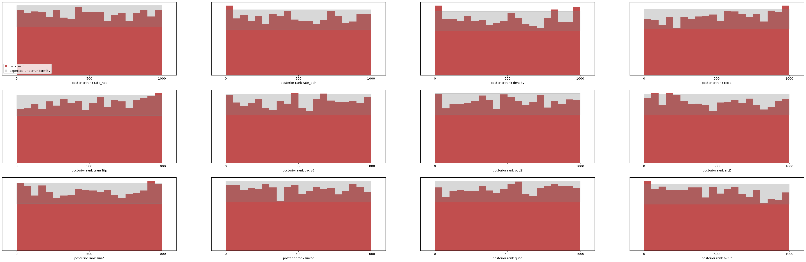
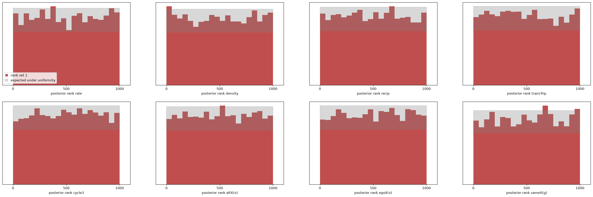
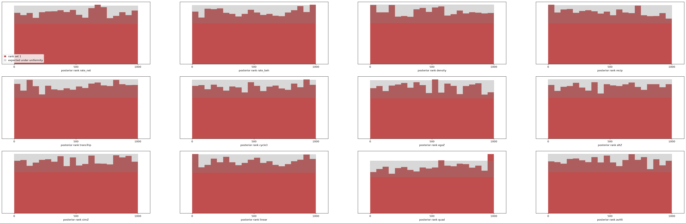

# M5: one estimator, nineteen schools

Design in `docs/PRIORS_M5.md`. The target is the Dutch Social Behavior study
(Baerveldt; Snijders & Baerveldt 2003): 19 school networks, two waves,
emotional-support ties, delinquency at both waves, sex. Data, per-school
RSiena fits and the `siena08` meta-analysis in `benchmarks/baerveldt/`
(`prepare_and_fit.R`, 2026-09-21). This is the first time the estimator is
asked for many real networks at once, and the first two-wave population since
M2.

## The network-only estimator (2026-09-22)

| | |
|---|---|
| population | `start="survey"`, n ~ U{30..100}, mean degree k ~ U(0.5, 6) on every start, half out-degree capped; two waves; rate U(1, 12); the M2 effect box |
| training set | 10⁶ panels, seed 100, 14 min on the Spark (1,190 panels/s) |
| estimator | NSF 8 × 128, batch 1024, lr 5e-4; 57 min |
| artefacts | `data/npe_m5.pt`, `npe_m5_sbc_pop.{npz,png}`, `models/screen_m5.npz`, `data/baerveldt/school*_posterior.npz`, `data/baerveldt_net_population.npz` |

### Calibration (fresh 4,000 draws, n ∈ [30, 100])

**Coverage within 1.2 points of nominal on all eight** (90 %: 0.886–0.899;
95 %: 0.938–0.951; binomial se 0.005). Mean ranks 0.468–0.521 with no drift
across the three n bands. KS rejects five of eight — rate 0.007, recip 0.000,
transTrip 0.008, egoX 0.000, altX 0.045 — on mean-rank tilts of 0.02 or less.
This is the 10⁶ signature seen on every previous population: coverage right,
small tilts that the 10⁷ budget removes. **The 10⁷ shards are still owed**;
everything below should be read as a 10⁶ result.

### s50, held out

All eight RSiena estimates inside the 90 % intervals, max |z| 1.52 (the rate,
4.90 ± 0.77 against 6.07 ± 1.03). The sparse population does not distort a
mid-range panel.

## The nineteen schools

Each school takes 0.4 s (`fit.py --posterior data/npe_m5.pt`). Against the
per-school RSiena fits, **141 of 152 parameter-school pairs lie inside the
90 % interval (93 %)**, which is what nominal coverage looks like, and no
parameter is systematically biased (mean z between −0.54 and +0.66).

| school | n | mean degree w1/w2 | inside | max \|z\| | parameters outside |
|---|---|---|---|---|---|
| 1 | 45 | 2.3/3.2 | 8/8 | 1.21 | |
| 3 | 37 | 1.1/1.9 | 8/8 | 0.69 | |
| 4 | 33 | 1.4/1.1 | 5/8 | 4.13 | density, transTrip, cycle3 |
| 6 | 36 | 1.7/2.4 | 8/8 | 0.38 | |
| 7 | 54 | 2.2/2.9 | 8/8 | 1.00 | |
| 8 | 91 | 1.9/2.2 | 8/8 | 0.58 | |
| 9 | 47 | 2.1/2.2 | 8/8 | 0.60 | |
| 10 | 31 | 1.7/2.5 | 8/8 | 0.58 | |
| 11 | 82 | 1.3/1.8 | 7/8 | 1.90 | sameX |
| 13 | 31 | 0.8/1.3 | 6/8 | 2.34 | transTrip, cycle3 |
| 14 | 90 | 1.9/3.4 | 7/8 | 2.30 | rate |
| 15 | 61 | 1.4/2.0 | 8/8 | 0.68 | |
| 16 | 45 | 1.3/1.6 | 6/8 | 1.91 | transTrip, cycle3 |
| 18 | 38 | 1.6/1.4 | 7/8 | 1.86 | density |
| 19 | 43 | 2.1/2.5 | 8/8 | 1.41 | |
| 20 | 48 | 1.1/1.3 | 6/8 | 2.30 | transTrip, cycle3 |
| 21 | 53 | 1.4/2.2 | 8/8 | 1.16 | |
| 22 | 52 | 1.7/2.2 | 8/8 | 1.17 | |
| 23 | 73 | 1.8/2.3 | 8/8 | 1.21 | |

### The eleven misses are two different things, and the diagnostic separates them

Nine of the eleven fall on five schools — 4, 13, 16, 18, 20 — and on those
schools **RSiena's estimate lies outside our prior box**:

| school | RSiena transTrip (box −0.5…1.5) | RSiena cycle3 (box −1.5…0.5) | RSiena density (box −4…0) |
|---|---|---|---|
| 4 | **2.23 ± 0.74** | **−2.82 ± 1.40** | −3.98 ± 0.70 |
| 13 | **1.70 ± 0.52** | **−1.66 ± 0.92** | |
| 16 | 1.32 ± 0.32 (edge) | **−1.62 ± 0.56** | |
| 20 | **1.53 ± 0.45** | **−1.88 ± 0.74** | |
| 18 | | | **−4.09 ± 0.70** |

The posterior cannot reach a value the prior excludes, so it piles against the
face — and **the face warning fires on exactly those five schools and on no
others**: transTrip 26 % (school 13), density 11 % (18), cycle3 5–6 % (4, 16,
20), nothing above the 5 % threshold anywhere else. Five detections, five
box violations, no false alarms in the other fourteen. The percentile screen
stays silent throughout, correctly: these panels are ordinary members of the
population, it is θ that is outside the box, which is the failure mode
`docs/OOD_RESULTS.md` says the screen cannot see and the face warning can.

The remaining two misses — school 11's sameX (z 1.90) and school 14's rate
(z 2.30) — are ordinary tail events; at nominal coverage about 7.6 of 152
pairs are expected outside a 90 % interval and 11 were, of which these two are
not attributable to the box.

**What this costs and how to fix it.** The effect box came from published
mid-density friendship networks (`docs/PRIORS.md` §3: transTrip "typical
estimates 0.2–0.8"). Emotional-support networks at mean degree 1 produce much
stronger closure parameters, because closure has to explain a great deal of
structure in very few ties. The box for a sparse population should be widened
— transTrip to about 3, cycle3 to about −3.5, density to −5 — and the
population regenerated. That is an M5 v2 item and it applies to the
co-evolution estimator now training on the same box.

## Population stage

`benchmarks/population_stage.py`: a normal–normal random-effects model over
the 19 posteriors (mean and sd per school), the Bayesian analogue of what
`siena08` fits by iteratively reweighted least squares on the RSiena point
estimates. Two routes that share no machinery.

| parameter | our μ [90 %] | `siena08` μ | our τ | `siena08` σ |
|---|---|---|---|---|
| rate | 4.94 [4.28, 5.64] | 5.56 | 1.44 | 1.65 |
| density | −2.95 [−3.08, −2.81] | −2.89 | 0.24 | 0.25 |
| recip | 2.41 [2.24, 2.58] | 2.27 | 0.26 | 0.18 |
| transTrip | 0.89 [0.79, 0.98] | 0.82 | 0.13 | 0.13 |
| cycle3 | −0.60 [−0.76, −0.46] | −0.60 | 0.20 | 0.17 |
| altX(delinq) | −0.08 [−0.13, −0.03] | −0.06 | 0.07 | 0.07 |
| egoX(delinq) | 0.02 [−0.07, 0.11] | 0.01 | 0.16 | 0.11 |
| sameX(sex) | 0.50 [0.36, 0.64] | 0.52 | 0.24 | 0.20 |

Every population mean agrees within its interval and every between-school
spread within a few hundredths. The five box-affected schools pull μ for
transTrip and cycle3 slightly toward zero relative to `siena08`, as they must.

**Can any mechanism be called variable across schools?** Not at this
resolution. The recovery study in `population_stage.py` fixes what the design
can say: with 19 groups measured to a posterior sd of s, between-group
variation much below s is not identified. Here τ never exceeds the median
per-school posterior sd (`s_med` 0.13–0.96), so for every mechanism the honest
statement is "no variation detectable beyond measurement error", not
"invariant". `siena08`'s own test reports σ > 0 for rate, density, transTrip,
egoX and sameX, on a weaker criterion (is σ distinguishable from zero, not is
it larger than the per-group uncertainty).

This is the central practical finding for a multi-group design: **locating the
average mechanism is easy and cheap; measuring how much it varies needs either
more schools or larger ones.** Nineteen schools of 31–91 pupils, each observed
twice, are enough for the first and not the second.

## The co-evolution estimator: selection and influence on delinquency

Same population, network x delinquency (12 parameters at two waves): 10⁶
panels in 19 min, trained in 58 min (best validation loss 3.824 at epoch 92 of
112). Artefacts `data/npe_coev_m5.pt`, `models/screen_coev_m5.npz`,
`data/baerveldt/coev_school*_posterior.npz`.

### Calibration (fresh 4,000 draws)

**Coverage within 2.1 points of nominal on all twelve** (90 %: 0.879–0.900;
95 %: 0.936–0.951). Mean ranks 0.481–0.515. KS rejects three of twelve — avAlt
0.000 (mean rank 0.481), recip 0.002 (0.515), altZ 0.020 (0.490) — the usual
10⁶ tilts.

### The nineteen schools

RSiena's co-evolution fit diverges on two schools (1 and 13: the update step
exceeded RSiena's `thetaBound`), so there are 17 comparisons. **193 of 204
parameter-school pairs inside the 90 % interval (95 %)**, mean z between −0.89
and +0.65. The amortized estimator returns a posterior for schools 1 and 13 as
well — wide ones, which is the point: where stochastic approximation has no
answer, the posterior says how little the data determine.

Delinquency, across the 19 schools:

| | population μ [90 %] | τ | s_med | range of school means |
|---|---|---|---|---|
| selection (simZ) | **1.46 [1.05, 1.86]** | 0.25 | 1.09 | 0.68 … 2.36 |
| influence (avAlt) | **1.96 [1.51, 2.41]** | 0.31 | 1.16 | −0.06 … 2.76 |
| shape (quad) | −0.55 [−0.68, −0.43] | 0.12 | 0.33 | |
| behaviour rate | 1.47 [1.26, 1.71] | 0.22 | 0.44 | |

Both selection and influence are clearly positive at the population level —
pupils choose friends with similar delinquency *and* move toward their
friends' level — which is the Snijders & Baerveldt (2003) finding, reached
here from 19 posteriors rather than 19 estimation campaigns. Neither τ is
resolvable: the per-school posterior sd (≈ 1.1) is four times the estimated
between-school spread, so **these data cannot say whether selection or
influence differs between schools**, only what they are on average. Two waves
and 31–91 pupils are simply not much information about a behaviour process.

Only the network rate has variation exceeding per-school uncertainty
(τ 1.57, s_med 0.98, resolved) — schools differ in how fast their networks
change, which is the least theoretically interesting of the parameters.

### The influence–curvature ridge again

The joint posteriors show the same geometry as s50 and Glasgow: quad × avAlt
correlates **−0.63 (range −0.84 to −0.44)** in every school, while selection
and influence are nearly independent (simZ × avAlt −0.04). The ridge that
makes influence hard to pin down is a property of the model and the design,
not of one dataset — nineteen further instances of it.

## The widened box (2026-09-22 evening)

The box above was the M1/M2 one, set on mid-density friendship networks. Five
schools broke it. `--box sparse` (`SPARSE_RANGES`, `docs/PRIORS_M5.md`) widens
density to U(−5, 0), transTrip to U(−0.5, 3) and cycle3 to U(−3.5, 0.5), on
the argument that a network at mean degree 1 needs a larger closure
coefficient to reproduce the same structure. Both estimators regenerated and
retrained at 10⁶ (`npe_m5b.pt`, `npe_coev_m5b.pt`, screens `models/screen_m5b.npz`
and `models/screen_coev_m5b.npz`, fits in `data/baerveldt_b/`).

**Every box violation is gone.** All 19 schools now have all eight network
parameters inside the 90 % interval (151 of 152 pairs), and the schools that
failed before are unremarkable:

| school | max \|z\|, default box | max \|z\|, sparse box |
|---|---|---|
| 4 | 4.13 | **1.32** |
| 13 | 2.34 | **0.94** |
| 16 | 1.91 | **0.73** |
| 18 | 1.86 | **0.80** |
| 20 | 2.30 | **0.68** |

Co-evolution: 195 of 204 pairs inside (96 %, from 95 %), and its SBC is
slightly *better* than the narrow box's (90 % coverage 0.886–0.902; KS
rejects three of twelve).

**What the widening costs, and where.** Posterior sds, averaged over the 19
schools, sparse box relative to default:

| parameter | network | co-evolution |
|---|---|---|
| transTrip | 1.52× | 1.45× |
| cycle3 | 1.42× | 1.44× |
| density | 1.18× | 1.22× |
| rate, recip, covariate effects | 1.04–1.16× | 1.03–1.15× |
| **simZ, avAlt, linear, quad** | — | **0.96–1.01×** |

The cost falls on the three parameters that were widened and nowhere else. In
particular **selection and influence are untouched**, so the substantive
result below does not depend on the prior box — the best evidence available
that it is not an artefact of it.

One caveat, and it is budget: the network SBC is *worse* than at the narrow
box (KS rejects six of eight, 90 % coverage 0.873–0.905, i.e. slightly under
nominal on density and cycle3), because the same 10⁶ panels now have to cover
a larger parameter volume. This is the argument for 10⁷ made concrete, and
the section below is the result.

On widths: under the default box transTrip's posterior sd was 0.200 against
RSiena's own standard error of 0.241 — narrower than RSiena's while being
truncated, i.e. confidently wrong; under the sparse box it is 0.303, wider
than RSiena's. (An earlier draft of this section read the spread of z against
RSiena's point estimates — 0.55 rather than ≈ 1 — as evidence that the
intervals had become conservative. That inference was wrong. z compares two
estimators applied to the *same* data, so it measures the gap between them,
not either one's coverage; when both recover θ well the gap is far smaller
than either posterior sd, and sd(z) < 1 follows. Calibration is what the SBC
measures, and the SBC said these intervals were slightly under-covering, not
over.)

### Population stage on the widened box

| parameter | our μ | `siena08` μ | our τ | `siena08` σ |
|---|---|---|---|---|
| rate | 5.00 | 5.56 | 1.49 | 1.65 |
| density | −3.07 | −2.89 | 0.27 | 0.25 |
| recip | 2.52 | 2.27 | 0.30 | 0.18 |
| transTrip | 0.93 | 0.82 | 0.17 | 0.13 |
| cycle3 | −0.58 | −0.60 | 0.26 | 0.17 |
| sameX(sex) | 0.51 | 0.52 | 0.31 | 0.20 |

Co-evolution: selection 1.35 [0.92, 1.77] and influence 2.21 [1.78, 2.63],
against 1.46 and 1.96 on the default box — both shifted by less than a third
of their own posterior sd. Still no τ resolvable above the per-school
uncertainty.

## At 10⁷ on the corrected population (2026-09-23)

Ten shards of 10⁶ on the sparse box (2 h 21 m), trained in 10 h 54 m
(`data/m5c_shards/`, `npe_m5c.pt`, fits in `data/baerveldt_c/`).

### Calibration (fresh 4,000 draws)

**No parameter's rank distribution is rejected** (smallest KS p 0.102, sameX;
next 0.119, transTrip), mean ranks 0.494–0.507, 90 % coverage 0.889–0.904 and
95 % 0.938–0.953 against a binomial se of 0.005. Set against the same test at
10⁶ — five of eight rejected on the default box, six of eight on the sparse
one — this is the clearest instance yet of the rule that a population is
judged at 10⁷, and the fourth population on which it has held.

| | KS rejections | 90 % coverage |
|---|---|---|
| 10⁶, default box | 5 of 8 | 0.886–0.899 |
| 10⁶, sparse box | 6 of 8 | 0.873–0.905 |
| **10⁷, sparse box** | **0 of 8** | **0.889–0.904** |

### The schools at 10⁷

All 19 schools have all eight parameters inside the 90 % interval
(152 of 152), with a largest |z| of 1.47 anywhere in the study. The
posteriors are 3–17 % narrower than at 10⁶ and now sit on RSiena's own
standard errors:

| parameter | our sd, 10⁶ | our sd, 10⁷ | RSiena se |
|---|---|---|---|
| rate | 1.060 | 1.068 | 1.011 |
| density | 0.307 | 0.288 | 0.298 |
| recip | 0.389 | 0.373 | 0.379 |
| transTrip | 0.303 | 0.251 | 0.241 |
| cycle3 | 0.490 | 0.452 | 0.446 |
| sameX(g) | 0.293 | 0.285 | 0.260 |

Two estimators that share no machinery, on nineteen real networks, agreeing
both on where the parameters are and on how well they are determined.

### Population stage at 10⁷

| parameter | our μ [90 %] | `siena08` μ | our τ | `siena08` σ |
|---|---|---|---|---|
| rate | 5.16 [4.45, 5.91] | 5.56 | 1.54 | 1.65 |
| density | −2.97 [−3.12, −2.82] | −2.89 | 0.25 | 0.25 |
| recip | 2.48 [2.30, 2.66] | 2.27 | 0.32 | 0.18 |
| transTrip | 0.94 [0.81, 1.10] | 0.82 | 0.24 | 0.13 |
| cycle3 | −0.72 [−0.93, −0.53] | −0.60 | 0.27 | 0.17 |
| altX(delinq) | −0.07 [−0.12, −0.01] | −0.06 | 0.08 | 0.07 |
| egoX(delinq) | 0.00 [−0.08, 0.07] | 0.01 | 0.11 | 0.11 |
| sameX(sex) | 0.53 [0.38, 0.69] | 0.52 | 0.29 | 0.20 |

Still no τ whose 5th percentile clears the median per-school posterior sd:
**more training does not buy resolution on between-school variation**, because
that limit comes from the schools' size and the two-wave design, not from the
estimator. This is the cleanest statement of the finding: the same estimator
that now matches RSiena's precision per school still cannot say whether any
mechanism differs between schools.

### The co-evolution estimator at 10⁷

Ten shards (3 h 22 m), trained in 20 h 40 m — twice the network model's, for
12 parameters and 41 summaries. `npe_coev_m5c.pt`, fits in `data/baerveldt_c/`.

**Coverage within 1.0 point of nominal on all twelve** (90 %: 0.890–0.906;
95 %: 0.938–0.952). KS rejects one of twelve — quad at 0.004, mean rank 0.514
— against three of twelve at 10⁶.

Against RSiena on the 17 schools where its co-evolution fit converges, **203
of 204 pairs inside the 90 % interval**. The fairer comparison, which
accounts for RSiena's own standard error as well as our posterior width, puts
**204 of 204 within 1.645 combined standard deviations, largest 1.52**:

| | vs RSiena's point alone | with RSiena's se included |
|---|---|---|
| 10⁶ sparse box | 96 % | 99 %, max 2.12 |
| **10⁷ sparse box** | **99 %** | **100 %, max 1.52** |

School 9 is the instructive case for why the combined comparison is the right
one: RSiena's behaviour estimates there are essentially unidentified (avAlt
4.55 ± 6.54, quad −1.59 ± 2.06, simZ 4.13 ± 3.31), so a posterior interval
that excludes its point estimate says nothing. Our posterior on the same
school is an order of magnitude tighter and inside the combined bound.

**Where the amortized posterior is sharper than RSiena**, averaged over the
17 schools:

| parameter | our sd | RSiena se | ratio |
|---|---|---|---|
| avAlt (influence) | 1.17 | 1.83 | **0.64** |
| quad | 0.31 | 0.47 | **0.66** |
| linear | 0.34 | 0.41 | 0.83 |
| simZ (selection) | 1.06 | 1.25 | 0.85 |
| structural block | — | — | 0.95–1.07 |
| egoZ, altZ, rate_beh | — | — | 1.14–1.18 |

On the structural parameters the two methods are within a few per cent. On
the *behaviour* parameters — the ones the study is about — the amortized
posterior is a third narrower, because the method of moments has to estimate
them from two waves of a five-point scale by stochastic approximation while
the flow has seen ten million panels of the same design.

### Population stage at 10⁷ (co-evolution)

| | μ [90 %] | τ | s_med | resolved |
|---|---|---|---|---|
| selection (simZ) | **1.40 [1.00, 1.79]** | 0.26 | 1.06 | no |
| influence (avAlt) | **1.76 [1.28, 2.24]** | 0.58 | 1.15 | no |
| quad | −0.52 [−0.64, −0.41] | 0.10 | 0.31 | no |
| behaviour rate | 1.45 [1.23, 1.69] | 0.24 | 0.52 | no |
| network rate | 5.03 [4.31, 5.79] | 1.63 | 1.02 | **yes** |

Selection 1.40 and influence 1.76 against 1.46/1.96 at 10⁶ on the default box
and 1.35/2.21 on the sparse box at 10⁶: three estimators, two prior boxes and
two budgets, all within a third of a posterior sd of each other. Both
mechanisms are clearly positive across the 19 schools.

The network rate is the only parameter whose between-school variation clears
the per-school uncertainty, at every budget and box we have tried. **How fast
a network changes differs between schools; how strongly its actors select and
influence cannot be shown to.**

## Still to come

- A sienaBayes comparison, a summary-set ablation and sienaGOF-style network
  predictive checks (`recommendations for the paper.md`).
- Knecht klas12b is read by the three-wave M4 estimators (`docs/M4_RESULTS.md`);
  a wave-generic summary vector would let one estimator read both.
- The behaviour-side screen flags to understand: `x0_egoZ` below the 2nd
  percentile in schools 1, 9, 14, 15, 22 and `z0_z_sd` in 14, 18, 19, 22. The
  population's starting delinquency distributions are evidently narrower than
  the schools'.
