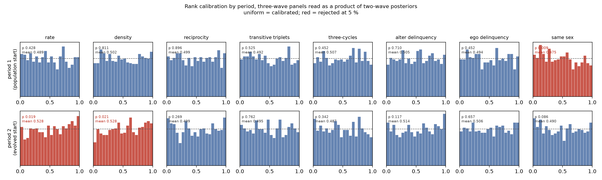

# Reading a panel of any length with a two-wave estimator

*2026-09-26.*

Until now the wave count was baked into the estimator. `npe_m5c.pt` read two waves and
returned one rate; `npe_m4b.pt` read three and returned two. They condition on summary
vectors of different lengths (29 against 42 for the network model, 41 against 62 for
co-evolution) and emit θ of different dimensions, so they are different estimators
trained on different populations, and an analyst with a four-wave classroom had neither.

That is a worse problem than it looks for a package. Shipping two estimators with a flag
to choose between them makes the wave count a property of the *tool* rather than of the
*data*, and it stops at three.

## The factorisation

It is unnecessary. A SAOM's likelihood already factorises over periods, because each
period is conditioned on the **observed** start of that period rather than on a latent
state:

    p(theta | x_0 .. x_W)  =  p(theta) * prod_w L_w(beta, rate_w ; x_{w-1} -> x_w)  / Z

Our priors are flat on a box. So the two-wave posterior for period *w*, which is what a
two-wave estimator returns,

    q_w(rate_w, beta)  =  L_w * 1_box / Z_w,

is the likelihood up to a constant, and the product over periods

    prod_w q_w(rate_w, beta)  ∝  1_box * prod_w L_w  =  p(theta | x_0 .. x_W)

**is** the joint posterior over (rate_1 .. rate_{W-1}, beta), up to normalisation. The box
indicator is idempotent, so raising it to the power W-1 changes nothing.

Three things follow, none of which required retraining anything:

* One two-wave estimator reads a panel of **any** length, W >= 2.
* The per-period rates appear on their own, instead of the wave count fixing dim(θ).
* The shared-β constraint is imposed explicitly by the product, rather than left for a
  joint flow to infer from training data.

The flat prior is load-bearing. Under a non-flat prior the product over-counts it and the
correction is division by p(beta)^(W-2); every population in this project is flat on a
box (`docs/PRIORS_M*.md`), so the correction is a constant and drops out.

## Getting the per-period conditioning vectors

`saomsim/multiwave.py`. The network summary layout is already period-modular —
`[n, covariate shape (3)] [x0 block (12)] [per period: changes + 12 stats]` — and the
x_w block carries the same twelve statistics of wave *w* that an x0 block would, with a
change count in front. Period *w*'s two-wave vector is therefore a **pure re-slice** of
the W-wave vector,

    x0_<stat> <- x{w-1}_<stat>,      x1_<stat> <- x{w}_<stat>,

with the covariates, which are time-constant, shared across periods. No network is
touched and nothing is recomputed. `tests/test_multiwave.py` checks the re-slice against
summaries computed from the waves themselves, to exact equality.

Co-evolution does not re-slice, and the reason is worth recording because it fails
*silently*. A start block carries `selection_statistics(X_w, z_w)` — network and
behaviour at the same wave — whereas the x_w block of a W-wave vector carries
`selection_statistics(X_w, z_{w-1})`, RSiena's cross-lagged convention. Every name in the
two-wave layout still resolves to a name in the longer one, so a naive re-slice returns
a full vector of the wrong numbers. `period_view_index` refuses co-evolution panels
beyond the first period and points at `coev_period_views`, which recomputes each period's
vector from the waves. That is a deterministic function of the observed panel, not a
simulation: for a four-wave classroom it is three calls on data already in memory.

## Sampling the product

`benchmarks/multiwave.py`. Writing phi = (rate_1 .. rate_P, beta),

    log pi(phi) = sum_w log q_w(rate_w, beta),     -inf outside the box.

Each q_w is a normalising flow, so its density is available directly and the box needs no
separate enforcement. We summarise each q_w by the mean and covariance of its draws; as a
Gaussian it carries precision A_w' S_w^-1 A_w into phi-space, where A_w selects
(rate_w, beta), so the Gaussian product has precision sum_w A_w' S_w^-1 A_w in closed
form. We propose from a multivariate t on that mean and covariance and weight by the
exact flow densities, falling back to adaptive random-walk Metropolis when the effective
sample size is too small.

Two measured details that went against expectation:

* **Do not inflate the proposal.** The Gaussian product is already *wider* than the true
  product, because the flows have lighter tails than a Gaussian where they concentrate.
  Inflating by 1.5–4.0 cut the effective sample size by a factor of two to twenty in both
  models, so `inflate` defaults to 1.0.
* **Report ESS as a count, not a fraction.** 3,500 effective draws out of a poorly matched
  400,000 is a usable posterior; 2 % of 5,000 is not.

### Two diagnostics that come free

**ESS** says whether the proposal found the product. **Period spread** — per shared
effect, max over period pairs of |mu_a - mu_b| / sqrt(s_a^2 + s_b^2) — asks whether the
periods actually agree about the shared β. The model *assumes* one β for the whole panel;
a large spread says the data disagree, which is a finding (a time-varying effect) and not
a numerical complaint. A joint estimator cannot show this, because it never forms the
per-period posteriors.

**Correct the threshold for multiplicity.** The flag fires at a standardised gap above 2,
uncorrected. A four-wave panel gives 3 period pairs × 7 effects = 21 comparisons, where
chance alone produces about one flag; the two flagged on the Knecht classroom
(`transTrip` 2.06, `egoX` 2.35) are what chance gives, P(≥2) = 0.25, and were described
here as a finding about the data when they are not one (`docs/AUDIT.md` §2). Read the
flag with the comparison count beside it.

## Does it work

### s50, three waves, network model

Against the purpose-built three-wave estimator and RSiena's three-wave fit. The product
uses `npe_m5c.pt` (two waves, sparse box, n 30–100); the joint uses `npe_m4b.pt` (three
waves, default box, n <= 200), so these are different populations and exact agreement is
not expected.

| parameter | product of two-wave | joint three-wave | RSiena MoM |
|---|---|---|---|
| rate_1 | 5.641 (1.012) | 5.421 (1.271) | 6.511 (1.073) |
| rate_2 | 5.088 (0.905) | 4.752 (0.832) | 5.304 (0.889) |
| density | −2.933 (0.194) | −2.684 (0.186) | −2.763 (0.160) |
| recip | 2.596 (0.238) | 2.480 (0.251) | 2.442 (0.214) |
| transTrip | 0.655 (0.133) | 0.606 (0.141) | 0.637 (0.148) |
| cycle3 | 0.008 (0.266) | −0.079 (0.262) | −0.074 (0.285) |
| altX(alc) | −0.039 (0.076) | −0.071 (0.079) | −0.021 (0.069) |
| egoX(alc) | 0.049 (0.071) | 0.045 (0.081) | 0.057 (0.077) |
| sameX(smk) | 0.193 (0.226) | 0.126 (0.211) | 0.168 (0.168) |

Every standardised gap is below 1: product against RSiena |z| <= 0.68, joint against
RSiena |z| <= 0.66, product against joint |z| <= 0.93. The product is **not** less precise
than the estimator built for three waves — on both rates it is sharper. That is a budget
difference rather than a property of the method: `npe_m5c` was trained on 10⁷ panels,
`npe_m4b` on 10⁶ (`docs/M4_RESULTS.md`, step 2). The honest reading is that splitting a
three-wave panel into two periods costs nothing measurable here, not that it gains.

> **Superseded, 2026-10-09.** That last sentence was wrong, and the comparison behind it
> was not fair: a 10⁷ estimator against a 10⁶ one, with the budget gap in the product's
> favour. `docs/PRODUCT_VS_NATIVE.md` runs the matched test — `npe_m8`, a three-wave
> estimator on the M6 population, differing from `npe_m6` in wave count alone, same 10⁷
> budget, both read on one shared set of 400 panels. **The product loses by 0.0156 of 90 %
> coverage (paired se 0.0046)** while being 2 % sharper, which is mild over-confidence. It
> is not the sampler: the gap is flat across ESS quartiles and grows slightly when the
> 2.8 % of panels that fell back to Metropolis are dropped. The best-supported explanation
> is the evolved-start shift described below, which a natively three-wave estimator does
> not suffer from, and which `docs/PRIORS_M7.md` shows cannot be trained away without
> breaking the factorisation.

### Calibration

`benchmarks/sbc_multiwave.py`, 400 three-wave panels drawn from the same population
`npe_m5c.pt` was trained on, each split into its two periods, combined, and the true θ
ranked within the joint draws.

This tests more than the algebra. Period *w* is conditioned on x_{w-1}, which for w > 1
is an **evolved** network — the estimator never saw an evolved start in training. If that
distribution shift mattered, period 2 would be miscalibrated and the ranks would say so.

| parameter | KS p | mean rank | 90 % cov | 95 % cov |
|---|---|---|---|---|
| rate_1 | 0.251 | 0.489 | 0.905 | 0.973 |
| rate_2 | 0.113 | 0.518 | 0.892 | 0.943 |
| density | **0.045** | 0.514 | 0.887 | 0.948 |
| recip | 0.355 | 0.478 | 0.907 | 0.950 |
| transTrip | 0.779 | 0.506 | 0.922 | 0.960 |
| cycle3 | 0.438 | 0.495 | 0.922 | 0.965 |
| altX(v) | **0.013** | 0.538 | 0.895 | 0.955 |
| egoX(v) | 0.453 | 0.493 | 0.895 | 0.940 |
| sameX(g) | 0.294 | 0.484 | 0.855 | 0.912 |

Seven of nine pass; `density` and `altX` are rejected, and `sameX` covers 0.855 against a
nominal 0.90 with a binomial se of 0.015. Two rejections out of nine tests at α = 0.05 is
more than the ~0.45 expected by chance, and an independent repeat of the whole test gave
the same picture (altX 0.019, density 0.059, sameX coverage 0.850), so this is a small
real miscalibration rather than noise. It is also a **degradation**: `npe_m5c`'s own
two-wave SBC rejects 0 of 8 with 90 % coverage 0.889–0.904 (`docs/M5_RESULTS.md`).

### Where the degradation comes from

`--per-period` skips the product and calibrates each period's two-wave posterior on its
own, against (rate_w, β). Same estimator, same panels, so the two columns are directly
comparable — and they separate the distribution shift from anything the product does.
1,000 panels:

| parameter | period 1 KS p | mean rank | 90 % cov | | period 2 KS p | mean rank | 90 % cov |
|---|---|---|---|---|---|---|---|
| rate | 0.428 | 0.489 | 0.891 | | **0.019** | **0.528** | 0.878 |
| density | 0.811 | 0.502 | 0.897 | | **0.021** | **0.528** | 0.909 |
| recip | 0.896 | 0.499 | 0.889 | | 0.269 | 0.499 | 0.868 |
| transTrip | 0.525 | 0.492 | 0.902 | | 0.762 | 0.495 | 0.897 |
| cycle3 | 0.452 | 0.507 | 0.914 | | 0.342 | 0.487 | 0.895 |
| altX(v) | 0.710 | 0.505 | 0.903 | | 0.117 | 0.514 | 0.866 |
| egoX(v) | 0.452 | 0.494 | 0.898 | | 0.657 | 0.506 | 0.894 |
| sameX(g) | **0.009** | 0.475 | 0.902 | | 0.086 | 0.490 | 0.874 |

**Read the mean rank, not the p-value.** Two independent runs of this test, on different
simulated panels, gave *identical* mean ranks — 0.528, 0.528 and 0.475 on the three
flagged cells — while their KS p-values moved from 0.008 to 0.019, from 0.014 to 0.021
and from 0.008 to 0.009. The tilt is the stable quantity; the p-value attached to it is
itself a random variable, and quoting it to three figures would imply a precision the
test does not have. The figure shows why the tilt is real: period 2's rate and density
ranks rise smoothly across the whole range rather than spiking in one bin.

Period 1 starts from a network drawn the way the training population draws them and is
clean, 7 of 8 passing. Period 2 starts from an **evolved** network — something the
estimator never saw in training — and rejects `rate` and `density`, both with the mean
rank pushed to 0.528. The direction is informative: a rank above 0.5 means the truth sits
above the posterior median more often than it should, so on an evolved start the
estimator reads the rate and the density slightly **low**. An evolved network is more
settled than a freshly drawn one, and the estimator has no way to know that.

The obvious reading is that the factorisation costs nothing and the training population
is at fault, so that a population whose starts have themselves been evolved would put
period 2 back in distribution. **We built that population, and the reading was wrong.**
It repairs the per-period tilt and makes the *joint* product markedly worse, because
making the start informative about β is precisely what the factorisation forbids. The
mechanism and the evidence are in "The evolved-start fix, and why it is not one" below;
the short version is that the independent-θ₀ burn-in is not an accident to be corrected
but a requirement of the construction.

### The joint product on the wider population, and why "0 of 9 rejected" is the wrong headline

400 three-wave panels from M6's own population, combined as usual:

| | `npe_m5c`, n ∈ [30, 100] | `npe_m6`, n ∈ [20, 150] |
|---|---|---|
| KS rejections | 2 of 9 | **0 of 9** |
| mean 90 % coverage | 0.898 | **0.885** |
| parameters below 0.885 | 1 of 9 | **4 of 9** |
| median ESS | 10 % | 8 % |

Read the first row alone and the wider population looks better calibrated, which would be
a strange thing for it to be. The second and third rows say the opposite: M6's joint
intervals are systematically **too narrow**, averaging a full standard error below nominal
where m5c averages on it.

The two rows can disagree because they test different things. The KS statistic tests the
*shape* of the rank distribution and is most sensitive to a tilt; coverage tests the
*width* of the interval. A posterior that is uniformly a little over-confident produces a
mild U-shape, and a mild U-shape at 400 draws is something the KS test has very little
power against. Quoting the rejection count without the coverage would have inverted the
conclusion here, which is a good reason to report both every time.

The one parameter carrying a visible tilt is `rate_2` (mean rank 0.534, KS p 0.053), and
it is the one the per-period test predicts: period 2's rate is exactly what the evolved
start biases. The shared effects average over both periods, so their tilts partly cancel
in the product, which is why the joint table looks milder than the per-period one below.

### The same test on a wider population (M6, 2026-09-27)

`npe_m6.pt` is the same population widened in n alone, from [30, 100] to [20, 150]
(`MODELS.md`). Repeating the per-period test on 1,000 panels from *its* population makes
the evolved-start effect look worse, not better:

| | period 1 (population start) | period 2 (evolved start) |
|---|---|---|
| rate | p 0.428, rank 0.490 | **p 0.023, rank 0.529** |
| density | p 0.603, rank 0.493 | **p 0.000, rank 0.551** |
| transTrip | p 0.930, rank 0.494 | **p 0.001, rank 0.466** |
| sameX(g) | p 0.988, rank 0.500 | **p 0.031, rank 0.522** |
| overall | 7 of 8 uniform | **4 of 8 rejected** |

Against `npe_m5c`'s two rejections in period 2, on the narrower range. Density's tilt
grows from 0.528 to 0.551 and transitive triplets acquires one in the opposite direction
(0.466, so read *high* where density and rate are read *low*). Period 1 stays clean on
both populations.

That is the expected direction if the cause is what we claim it is. A wider range of n
means a wider range of evolved networks for period 2 to start from, and none of them are
in the training population either way; the mismatch simply has more room.

Two later corrections to this paragraph, both from the M7 run. Most of M6's extra
rejections were *not* the wider n: M7 covers the identical range, adds evolved starts,
and rejects none of eight on its own two-wave SBC against M6's three. And the "fix" this
paragraph anticipated makes the product worse rather than better — see below.

`sameX` is a separate matter: it fails in period 1 as well (p = 0.009, mean rank 0.475
in both runs), so its weakness
belongs to `npe_m5c` and is merely inherited here.

### Knecht, four waves

A wave count nothing here was trained for, against RSiena's own four-wave fit
(`benchmarks/knecht/rsiena_network_w1to4.json`). **n = 25 is below `npe_m5c`'s training
range of [30, 100], so this is an extrapolation** and the tool says so before printing
anything; it is reported as a demonstration that the wave count is not a barrier, not as
a calibrated fit.

| parameter | product (one two-wave estimator) | RSiena, four waves | z |
|---|---|---|---|
| rate_1 | 6.982 (1.351) | 6.921 (1.285) | +0.03 |
| rate_2 | 8.025 (1.302) | 8.548 (1.641) | −0.25 |
| rate_3 | 7.314 (1.146) | 8.438 (1.389) | −0.62 |
| density | −1.978 (0.141) | −2.047 (0.127) | +0.37 |
| recip | 1.586 (0.208) | 1.479 (0.166) | +0.40 |
| transTrip | 0.359 (0.043) | 0.321 (0.033) | +0.70 |
| cycle3 | −0.428 (0.087) | −0.375 (0.068) | −0.48 |
| altX(delinq) | 0.123 (0.085) | 0.099 (0.069) | +0.22 |
| egoX(delinq) | −0.073 (0.079) | −0.015 (0.070) | −0.55 |
| sameX(sex) | 0.435 (0.154) | 0.634 (0.115) | −1.04 |

Largest |z| 1.04, on 14,133 effective draws. Period spread flags `transTrip` (2.06) and
`egoX` (2.35) — but those are not significant and should not be read as a finding. A
four-wave panel gives 21 comparisons at an uncorrected 2σ threshold, where chance alone
yields about one flag; P(≥2) = 0.25 (`docs/AUDIT.md` §2).

Knecht was previously read as two overlapping three-wave windows (w1–w3 and w2–w4), which
gives two answers and discards the constraint that β is shared across all three periods.
This gives one posterior over the whole panel.

### Knecht, four waves, friendship **and** delinquency

The same panel with the behaviour co-evolving: 16 parameters, three network rates, three
behaviour rates, and one shared set of selection and influence effects, against
`rsiena_coevolution_w1to4.json`. Before this, the classroom could only be read as
three-wave windows, so a four-wave co-evolution posterior did not exist. Same n = 25
extrapolation caveat.

| parameter | product | RSiena, four waves | z |
|---|---|---|---|
| rate_net_1 | 5.760 (1.032) | 5.829 | −0.05 |
| rate_net_2 | 7.004 (1.088) | 7.351 | −0.22 |
| rate_net_3 | 6.781 (1.020) | 7.695 | −0.61 |
| rate_beh_1 | 1.542 (0.916) | 0.984 | +0.55 |
| rate_beh_2 | 3.033 (1.274) | 2.063 | +0.60 |
| rate_beh_3 | 2.929 (1.192) | 2.375 | +0.32 |
| density | −1.870 (0.163) | −1.715 | −0.77 |
| recip | 1.812 (0.239) | 1.612 | +0.66 |
| transTrip | 0.419 (0.066) | 0.342 | +1.01 |
| cycle3 | −0.540 (0.111) | −0.398 | −1.09 |
| egoZ | −0.282 (0.250) | −0.149 | −0.46 |
| altZ | 0.277 (0.230) | 0.173 | +0.35 |
| simZ (selection) | 2.705 (0.772) | 2.433 | +0.17 |
| linear | −0.429 (0.216) | −0.252 | −0.59 |
| quad | −0.150 (0.225) | −0.080 | −0.25 |
| avAlt (influence) | 0.743 (0.908) | 0.334 | +0.37 |

Largest |z| 1.09. Notably the selection/influence pair agrees here (+0.17 and +0.37),
unlike Glasgow, where the amortized estimator reads both high against method of moments
(`docs/M4_RESULTS.md`) — though influence is barely identified in this classroom, at
0.743 (0.908).

### What extrapolation in n actually costs

Both out-of-range panels agree with RSiena about as well as the in-range one, at the two
opposite ends of the range:

| panel | n | estimator | in range? | largest \|z\| vs RSiena |
|---|---|---|---|---|
| s50, 3 waves | 50 | `npe_m5c` | yes | 0.68 |
| Knecht, 4 waves | 25 | `npe_m5c` | **no**, below | 1.04 |
| Knecht, 4 waves | 25 | **`npe_m6`** | **yes** | **0.62** |
| Glasgow, 3 waves | 129 | `npe_m5c` | **no**, above | 1.14 |
| Glasgow, 3 waves | 129 | **`npe_m6`** | **yes** | **1.62** |
| Knecht, 4 waves, co-evolution | 25 | `npe_coev_m5c` | **no**, below | 1.09 |
| Knecht, 4 waves, co-evolution | 25 | **`npe_coev_m6`** | **yes** | **1.23** |

`npe_m6` (n ∈ [20, 150], trained 2026-09-27) makes the two network demonstrations
legitimate rather than lucky, and they move in opposite directions. Knecht improves
markedly, from 1.04 to **0.62** across ten parameters. Glasgow gets worse, to **1.62**,
carried by the two rates, which read low.

Neither is cause for alarm, and the second is worth stating carefully rather than
explaining away. Under perfect calibration the largest of nine standardised differences
is typically around 1.9, so 1.62 is unremarkable and 0.62 is unusually good; a single
panel's largest \|z\| is a noisy statistic and neither number should carry much weight on
its own. What the M6 run buys is not better agreement — it is the right to quote these
comparisons at all, because the estimator is now calibrated where the data sit.

The co-evolution row is in range too, as of 2026-09-28: `npe_coev_m6` is the same
widening applied to the co-evolution population, 7 h 14 m to generate and 19 h 52 m to
train. Its largest |z| is 1.23 against 1.09 extrapolating — the same small worsening the
network model showed on Glasgow, and for the same reason: the wider population is less
well calibrated (3 of 12 rank distributions rejected against 1 of 12), which is the price
of covering the sizes. **No demonstration in this document is an extrapolation any
more.**

One caveat specific to this fit. The product sampler returns only 867 effective draws
here, far below what it manages on the network model, because the co-evolution target has
the influence–curvature ridge. The `--cross-check` Metropolis run is what makes the
numbers trustworthy: it agrees with importance sampling to 0.091 posterior sd with a
maximum split-Rhat of 1.037. On the co-evolution model that cross-check is not optional.

### Co-evolution efficiency

Importance sampling is inefficient on the co-evolution target — about 3,500 effective
draws from 400,000 on s50, 1,500 on the four-wave Knecht panel — because of the strong
influence–curvature ridge documented in `docs/M3_RESULTS.md`. That is efficiency, not
bias: adaptive Metropolis on the same target agrees with importance sampling to **0.081
posterior sd** across the 14 s50 parameters (accept 0.25, max split-Rhat 1.035) and
**0.139** across the 16 Knecht ones (accept 0.25, max split-Rhat 1.043). `--cross-check`
runs both and reports the largest gap; on the co-evolution model it is worth using.

## Limits

* **n range is now the binding constraint, not the wave count.** `npe_m5c` covers
  n in [30, 100], so of our three network benchmarks it can legitimately read only s50
  (n = 50); Knecht (25) and Glasgow (129) are outside. `TRAINED_N` in
  `benchmarks/multiwave.py` records each estimator's range and the tool prints a warning,
  because the screening references band n in steps of 20 and cannot tell 25 from 35 by
  themselves. A wider two-wave population (n in [20, 150], everything else held at the
  m5c setting) is in training.
* **Later periods start from evolved networks**, which the training population does not
  contain, and calibration is measurably (if mildly) worse there — rate and density read
  low, mean rank 0.528. This is **not** a defect to be fixed by putting evolved starts in
  the population: doing so repairs the marginal and breaks the product (below). It is the
  price of a factorisation that treats each wave as a fixed conditioning state, and a
  long panel's later periods carry a little more bias than its first as a result. The
  per-period columns of `--per-period` are how to see it.
* **Co-evolution needs a better proposal** than the Gaussian product before the
  importance sampler is comfortable; for now `--cross-check` is the answer.
* **The flat-box prior is assumed.** A non-flat prior needs the p(beta)^(W-2) correction.
* Period spread is reported but not yet acted on. A panel whose periods genuinely
  disagree about β violates the model, and the right response is a time-varying
  specification rather than a product posterior.

## Usage

    # three-wave s50, network model
    python benchmarks/multiwave.py --posterior data/npe_m5c.pt --real s50 --waves 3

    # any panel from CSVs, any number of waves
    python benchmarks/multiwave.py --posterior data/npe_m5c.pt \
        --waves-csv w1.csv w2.csv w3.csv w4.csv --v v.csv --g g.csv \
        --rsiena fit.json --cross-check --out posterior.npz

    # co-evolution, four waves, checked against an RSiena fit
    python benchmarks/multiwave.py --posterior data/npe_coev_m5c.pt \
        --waves-csv w1.csv w2.csv w3.csv w4.csv --behaviour z.csv \
        --rsiena fit.json --rsiena-labels net,delB --cross-check

    # calibration
    python benchmarks/sbc_multiwave.py --posterior data/npe_m5c.pt --N 400 --waves 3
